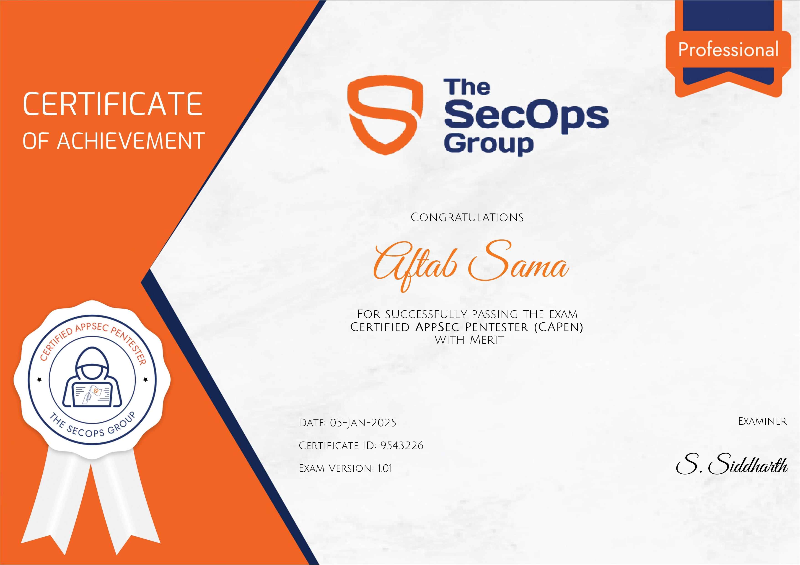

## About Exam

### What is CAPen

[Certified AppSec Pentester (CAPen)](https://secops.group/product/certified-appsec-pentester/) is an intermediate-level exam to test a candidate’s knowledge on the core concepts involving application security. Candidates must be able to demonstrate practical knowledge to conduct an application pentest to pass this exam.
**Note:** The CAPen exam is also listed in the preferred pathway for [SynAck’s SRT criteria](https://www.synack.com/red-team/pathways/).

### Cost

It costs £250.00 but they run discount deals on festivals like Diwali or Black Friday.

### What is the format of the exam?

CAPen is 4 hour long practical exam (you get 15 minutes extra for VPN configuration). The exam can be taken online, anytime (on-demand) and from anywhere. Candidates will need to connect to the exam VPN server to access the vulnerable applications. The VPN details are provided via mail within 24 hours of purchasing the exam.
Tip: If you face VPN issues while giving the exam just reconnect the VPN.

### What is the pass criteria for the exam?

The pass criteria are as follows:
- From 00.00% to 59.99% - Failed
- From 60.00 to 74.99% - Passed
- From 75.00 to 100.00% - Passed with Merit ( you get `passed with merit` written on you certificate)

### What is the exam retake policy?

Candidates, who fail the exam, are allowed 1 free exam retake.

### Proctoring

Exam is not proctored. You are allowed to access the internet during the exam and search related to any topic. However, you are not allowed to ask anyone to help during the exam.

### How long is the certificate valid for?

The certificate does not have an expiration date. However, the passing certificate will mention the details of the exam such as the exam version and the date. As the exam is updated over time.

### Do they provide Course/Training for Exam?

No, Being an independent certifying authority, The SecOps Group do not provide any training for the exam. You can go over each topic listed in the [syllabus](https://secops.group/product/certified-appsec-pentester/#:~:text=Free-,Exam%20Syllabus,-The%20exam%20will).

### Mock exams

They provide the [Mock Exams](https://secops.group/free-mock-pentesting-exams/) for free to get the idea about the exam. Must give Mock exam before the real one.

---

### Tips & Tricks

- Ensure all necessary tools are preconfigured:
	- [sslyze](https://github.com/nabla-c0d3/sslyze) - for SSL/TLS scanning.
	- Burp Suite or any other proxy tool of your choice.
	- Python or any scripting language you prefer.
	- [sqlmap](https://github.com/sqlmapproject/sqlmap) - an automatic SQL injection and database takeover tool.
	- [AWS CLI](https://docs.aws.amazon.com/cli/latest/userguide/getting-started-install.html) - for accessing S3 buckets.
	- [OpenVPN](https://openvpn.net/community-downloads/) - for connecting to the exam VPN.
- For OSINT-related challenges, search for the same username as the target or variations of it on platforms like GitHub, GitLab, Bitbucket, and Pastebin.
- Avoid trying to obtain a reverse shell. You will be provided with the file path where the flag is located, so read the flag directly. This will save you time.
- When you start the exam, the VPN may take some time to take effect. First, go through all the questions and take mental notes. Sometimes, one question can help solve another.
- Keep your notes handy or utilize online resources like [Payloads All The Things](https://swisskyrepo.github.io/PayloadsAllTheThings/) and [HackTricks](https://book.hacktricks.wiki/en/pentesting-web/web-vulnerabilities-methodology.html).
- Some vulnerabilities may require multi-step exploitation. Learn how to automate this process.

### My Thoughts on the Exam

The exam consists of 17 true/false, yes/no, multiple-choice, and CTF-type questions. Each question is allocated an appropriate score based on its level of difficulty.

In my opinion, the overall difficulty level was easy, not intermediate. However, each person's experience may vary.

The questions are very specific regarding the type of vulnerability class you will be exploiting, which makes the exam easier.

I have observed that the exam lacks dynamic questions. The questions and flags remain the same in every attempt. In my opinion, this is a significant drawback. If the exam questions are leaked, it would undermine the exam's credibility and reduce its value.

### Reference

- https://www.stationx.net/sqlmap-cheat-sheet/
- https://portswigger.net/web-security/csrf
- https://portswigger.net/web-security/xxe#exploiting-xxe-to-retrieve-files
- https://portswigger.net/web-security/access-control/idor
- https://portswigger.net/web-security/cross-site-scripting
- https://portswigger.net/web-security/file-upload
- https://developer.mozilla.org/en-US/docs/Web/HTTP/Headers

 

 

Happy Hacking

---
