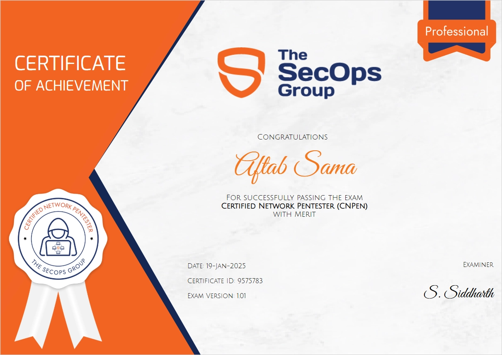

## About Exam

The exam formate is pretty much same as of Certified AppSec Pentester (CAPen) exam. you can read about that [here](https://aftabsama.com/blog/certified-appsec-pentester-capen-review/).

## My Thoughts on the Exam and Some Tips

The exam consists of 15 multiple-choice, and CTF-type questions. Each question is allocated an appropriate score based on its level of difficulty.

I think the exam difficulty was like an easy-rated HTB machine.
The following HTB machines are very close to the exam lab environment that I could find.
- [Cicada](https://0xdf.gitlab.io/2025/02/15/htb-cicada.html)
- [Jerry](https://0xdf.gitlab.io/2018/11/17/htb-jerry.html)
- [Sauna](https://0xdf.gitlab.io/2020/07/18/htb-sauna.html)
- [Hospital](https://0xdf.gitlab.io/2024/04/13/htb-hospital.html)

Make sure to read the above HTB write-ups. You will be using very similar techniques.

The [NetExec](https://www.netexec.wiki/) tool was very useful; make sure to get comfortable using it. During the exam, to use tools like [Mimikatz](https://github.com/gentilkiwi/mimikatz), you will need to transfer them to target machine. Learn some techniques on how to transfer files/tools between your machine and the target machine.

I have observed that the exam lacks dynamic questions. The questions and flags remain the same in every attempt. In my opinion, this is a significant drawback. If the exam questions are leaked, it would undermine the exam's credibility and reduce its value.

 

Happy Hacking

 

 

