## Setup Android Device & adb

You can either use the actual Android device or an Android emulator.
Any Android emulator such as [Genymotion](https://www.genymotion.com/product-desktop/) or [Android Studio](https://developer.android.com/studio) will work.

You can download [adb](https://developer.android.com/tools/adb) from [here](https://developer.android.com/tools/releases/platform-tools#downloads).

In the emulator, adb debugging is enabled by default. If you are using an Android device, you will need to [enable adb debugging on your device](https://developer.android.com/tools/adb#Enabling).

## Convert BurpSuites Certificate to PEM Format

Once you have Burp running in the background, you can visit the [proxy URL](http://127.0.0.1:8080/cert) to download the certificate.

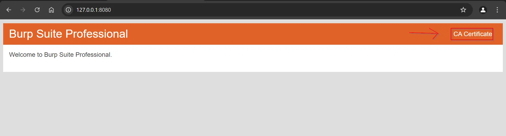

After downloading the `cacert.der` BurpSuites certificate file, run the following `openssl` command to convert this certificate to PEM format.

```
openssl x509 -inform der -in cacert.der -out burp.pem
```

Now we need to rename this file to the hash of the subject of the certificate. We can get that using the following command:
```
openssl x509 -inform pem -subject_hash_old -in burp.pem | head -1
```

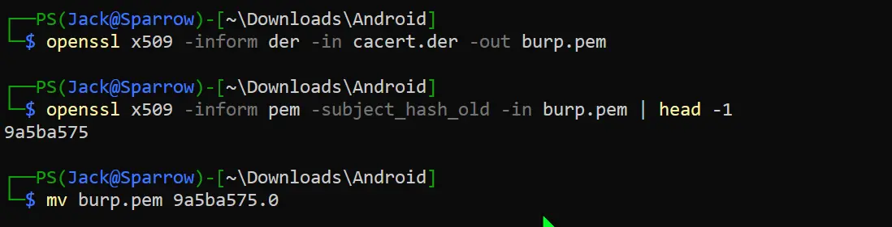


## Installing CA Certificate

### Installing Certificate from Android settings

To install the CA certificate on Android, go to settings and search for the certificate. Depending on the device, you should be able to see the option to install the certificate. \
Locate and install `burp.pem`, PEM format certificate file we previously converted.

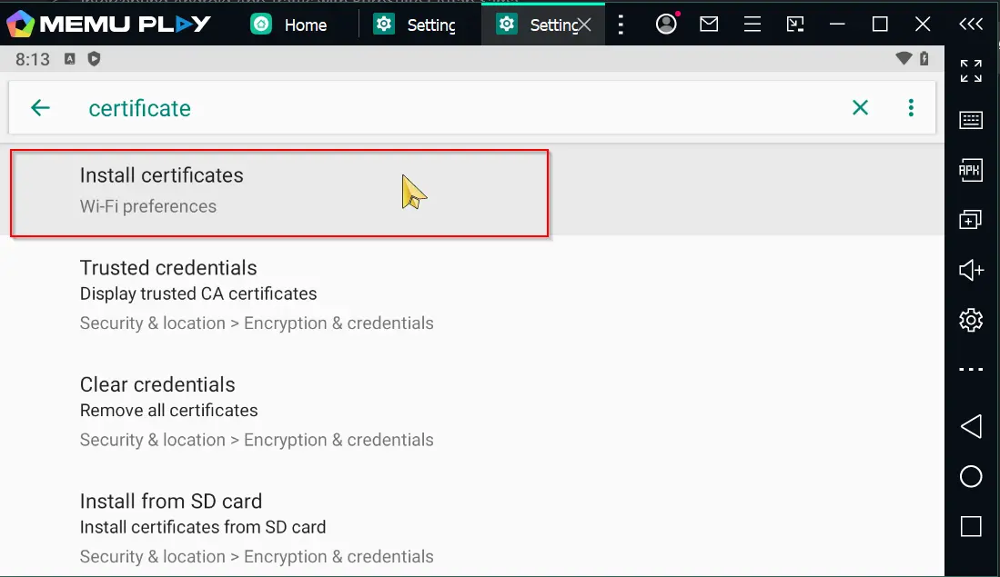

### Copying the Certificate to Android device using adb

First, ensure that your Android device appears in the `adb devices` command.

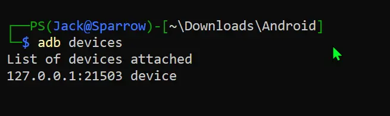

We need to copy our `9a5ba575.0` file to the `/system/etc/security/cacerts/` directory on the Android device.

```
adb push 9a5ba575.0 /system/etc/security/cacerts/
```

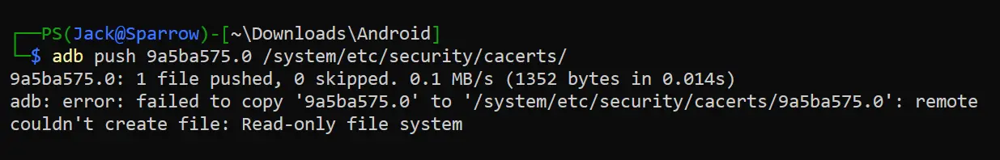

We get an error saying `Read-only file system`. To resolve this, We must remount to read-write .

```
adb shell mount -o remount,rw /system
```

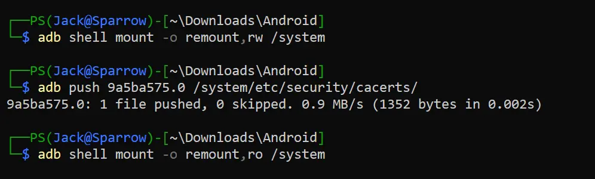


## Setup Proxy

To configure the proxy settings in Android via GUI, you can follow [these](https://proxyway.com/guides/android-proxy-settings) steps.

or you can use the gdb command to set and unset the proxy.

To set the proxy to `172.24.240.1:8080`:
```
adb shell settings put global http_proxy 172.24.240.1:8080
```
To unset the proxy:
```
adb shell settings put global http_proxy :0
```
Change the burp proxy settings to listen on all the interfaces. After setting up the proxy, you should be able to see some traffic. To test this, you can open any HTTPS site on an Android browser, and you should see that traffic in Burp Suite.

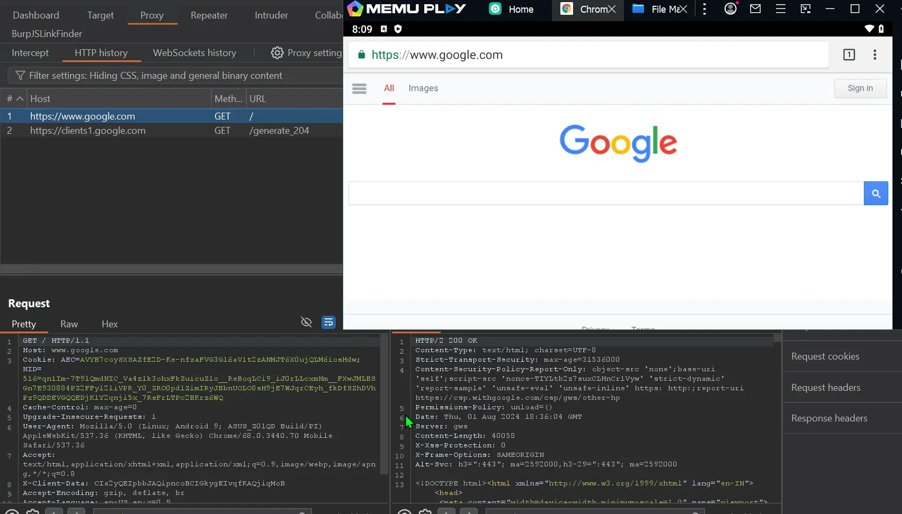

Now that we have installed a certificate and set up a proxy, we are able to view the HTTPS traffic for some apps, but not all. This is because certain applications use SSL pinning, which stops the app from recognizing our intercepting certificate as valid. As a result, we are unable to monitor the traffic between the application and the server.


## What is SSL Pinning

SSL pinning is a security technique used on the client side to protect against man-in-the-middle attacks. It works by embedding(or pinning) a list of trusted certificates into the client application during development. \
At runtime, the server certificate is compared against the local copy of trusted certificates. If there is a mismatch, the connection is disrupted, preventing any user data from being sent to the server. This ensures that user devices only communicate with trusted, dedicated servers.

## Bypassing SSL Certificate Pinning Using Frida (Requires Root)

It is often possible to bypass certificate pinning in most applications within seconds, but only if the app uses the API functions that these tools cover. If the app implements SSL pinning using a custom framework or library, SSL pinning must be manually patched and deactivated, which can be a time-consuming process.

### Installing Frida

To install [Frida’s](https://github.com/frida/frida) CLI tools on PC using `pip`, run the following command:
```
pip install frida-tools
```

We also need to download Frida for Android. To download the frida server for Android, go to the [release](https://github.com/frida/frida/releases/latest) page and download the suitable `frida-server-x.x.x-android-*` file.

To figure out which Android file to download, run the following command:
```
adb shell uname -a
```

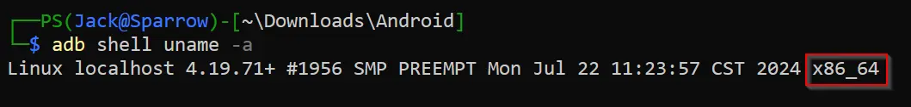

For me, it will be [frida-server-16.4.7-android-x86_64](https://github.com/frida/frida/releases/download/16.4.7/frida-server-16.4.7-android-x86_64.xz).

### Running Frida on an Android device

After downloading the Frida server for Android, decompress it and run the following commands to run Frida on Android:
```
adb push frida-server-16.4.7-android-x86_64 /data/local/tmp/
adb shell "chmod 755 /data/local/tmp/frida-server*"
adb shell "/data/local/tmp/frida-server* &"
```

To verify Frida is running, run the command `frida-ps -U` on your PC to list the running processes in Android.

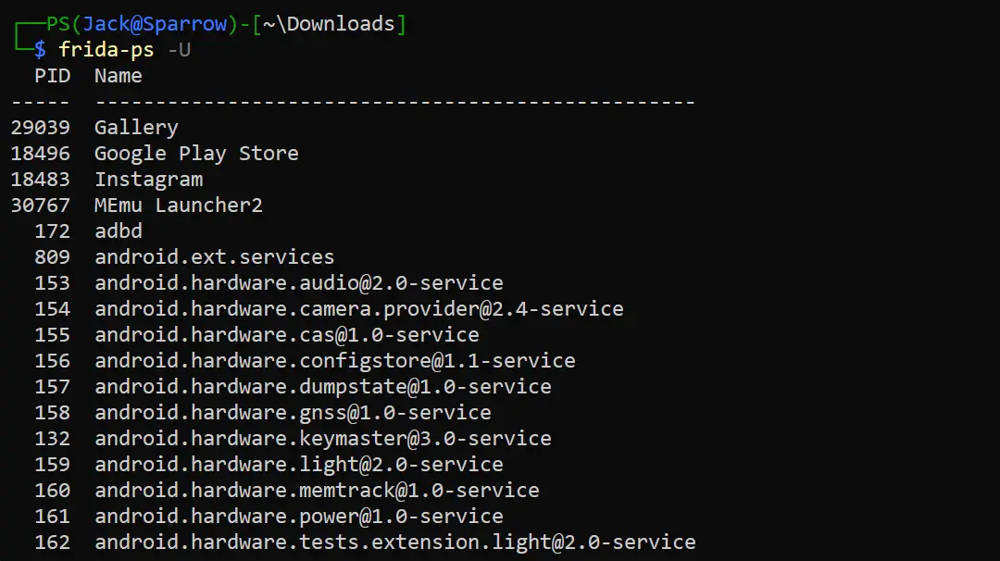

### SSL Pinning Bypass Script

Different apps utilize different methods to implement SSL pinning, so there is no one-size-fits-all solution. However, you can try the following general scripts:

#### Universal Android SSL Pinning Bypass with Frida

Download the `frida-android-repinning.js` file from [here](https://codeshare.frida.re/@pcipolloni/universal-android-ssl-pinning-bypass-with-frida/).

Move the `burp.pem` file, which was previously [converted](#convert-burpsuites-certificate-to-pem-format) from `cacert.der`, to `/data/local/tmp/cert-der.crt` on Android.
```
adb push burp.pem /data/local/tmp/cert-der.crt
```
Use frida to run the `frida-android-repinning.js` code into the target application.
```
frida -U -l frida-android-repinning.js -f com.test.app
```


#### Frida Multiple Unpinning

Download the `frida_multiple_unpinning.js` file from [here](https://gist.githubusercontent.com/akabe1/5632cbc1cd49f0237cbd0a93bc8e4452/raw/ec5b598eb506de05d8bbb1f8f6cb85f4b6d8a190/frida_multiple_unpinning.js) or [here](https://codeshare.frida.re/@akabe1/frida-multiple-unpinning/).

Use frida to run the `frida_multiple_unpinning.js` code into the target application.
```
frida -U -l frida_multiple_unpinning.js -f com.test.app
```


### Instagram SSL Pinning Bypass Script

To bypass SSL on the Instagram app, download the [instagram-ssl-pinning-bypass.js](https://github.com/Eltion/Instagram-SSL-Pinning-Bypass/blob/main/instagram-ssl-pinning-bypass.js) script and run the following command:
```
frida -U -l instagram-ssl-pinning-bypass.js -f com.instagram.android
```
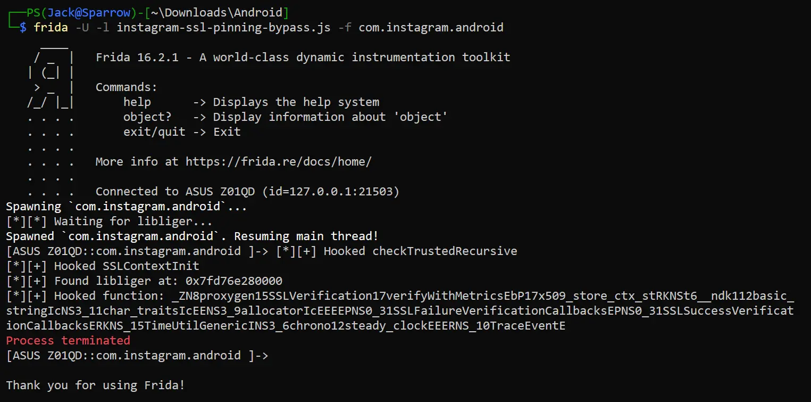

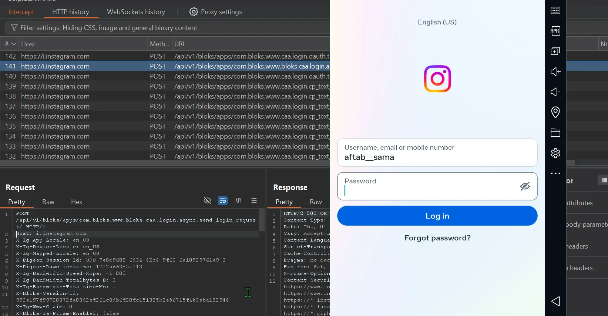


## References

- https://www.youtube.com/watch?v=xp8ufidc514
- https://mas.owasp.org/MASTG/techniques/android/MASTG-TECH-0012/
- https://medium.com/@vaishalinagori112/9-different-ways-to-bypass-ssl-pinning-in-android-2d8c7f81b837
- https://frida.re/docs/android/


<br>

Thank you for reading this far. Happy hacking!
