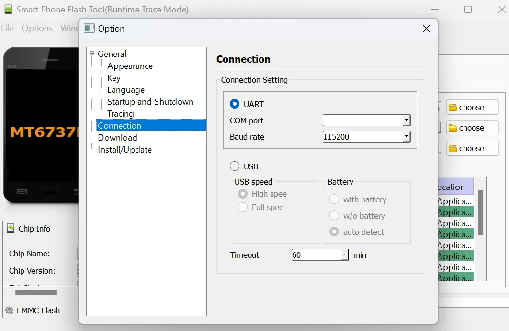
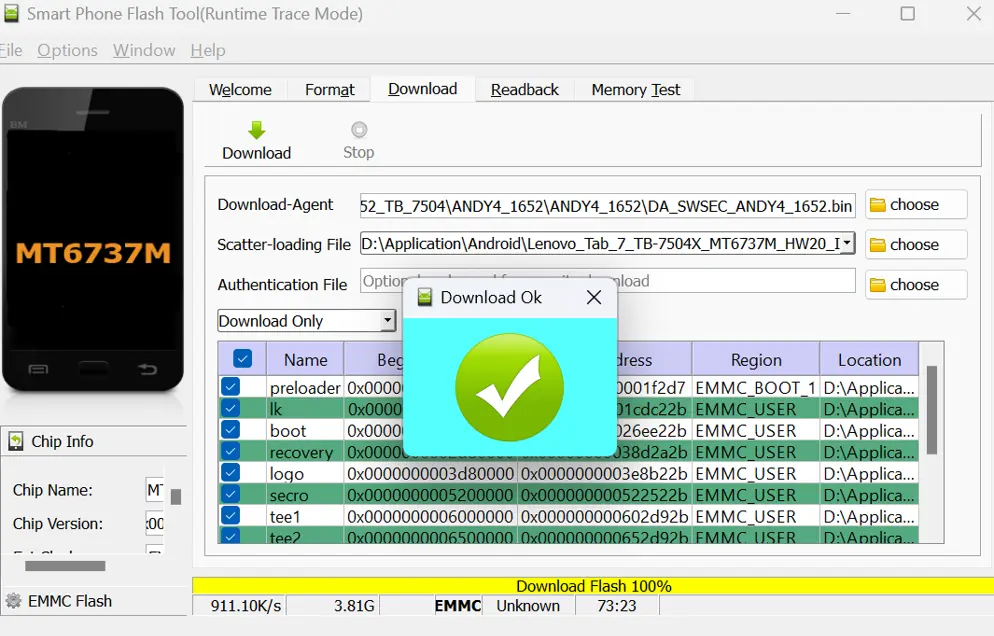

I wanted to install a custom ROM on my _Lenovo TB-7504x_.

First, I tried using SDK Platform-tools, but fastboot was not detecting my device in fastboot mode. It turned out that I was not using the correct driver. After installing all the required drivers, the device was detected. However, when I tried using commands, I encountered different errors such as `"command unknown"` or `"can't run when locked"` (even though OEM was unlocked and USB debugging was enabled).

I attempted to unlock the bootloader using fastboot and various combinations of commands. I even tried using `sn.img`, but it didn't work.
 
Finally, I successfully unlocked the bootloader using [mtkclient](https://github.com/bkerler/mtkclient). Details on how to use this tool can be found in the repository.

However, After unlocking the bootloader, the device goes into a boot loop and displays an error message that says `"Device verification failed. Device may not work properly. Booting in 5 seconds` and it continues to boot repeatedly.

Then I used the RSA(Rescue and Support Assistant) tool to reset and go back to a normal state, but the process started and failed. Now Device is only showing a black screen. \
I tried the SP flash tool to install custom ROM. SP flash tool was able to detect my device(It was not able to previously when the device was working) but it was giving an Authentication error `auth file needed`. I then tried auth files of other ROMs and different tools to bypass auth but no luck.

At this stage sometimes the SP flash tool was not detecting the device i tried pressing every combination of keys but not working. \
When I removed the device from settings under _Bluetooth & Devices_, disconnected the cable, and used a different USB port the device was now detected.

Finally, I was able to disable auth and install custom ROM using this article: https://www.getdroidtips.com/bypass-mediateks-sp-flash-tool-authentication-protection/

Tools I used:
- https://github.com/MTK-bypass/bypass_utility/releases
- https://github.com/MTK-bypass/exploits_collection/releases/tag/v1.6
- https://mtkusbdriver.com/mtk-usb-driver-v1-0-8/
- https://spflashtools.com/
- https://github.com/daynix/UsbDk/releases/
- https://droidfilehost.com/download/download-libusb-win32-devel-filter-1-2-6-0-zip/


After installing all the tools needed, copy everything from the `"exploits_collection"` directory to the `"bypass_utility"` directory. \
Now, run the `main.py` file and connect the device.

Output:

```powershell
PS C:\Users\Jack\Downloads\bypass_utility-v.1.4.2\bypass_utility-v.1.4.2> python .\main.py
[2023-06-28 10:54:15.788738] Waiting for device
[2023-06-28 10:54:21.156132] Found port = COM3

[2023-06-28 10:54:21.257535] Device hw code: 0x335
[2023-06-28 10:54:21.257535] Device hw sub code: 0x8a00
[2023-06-28 10:54:21.257535] Device hw version: 0xcb00
[2023-06-28 10:54:21.257535] Device sw version: 0x0
[2023-06-28 10:54:21.257535] Device secure boot: True
[2023-06-28 10:54:21.268082] Device serial link authorization: False
[2023-06-28 10:54:21.268082] Device download agent authorization: True

[2023-06-28 10:54:21.268082] Disabling watchdog timer
[2023-06-28 10:54:21.268082] Disabling protection
[2023-06-28 10:54:21.353772] Protection disabled
PS C:\Users\AFTAB SAMA\Downloads\bypass_utility-v.1.4.2\bypass_utility-v.1.4.2>
```

Now, go to the `options` in the SP flash tool and change the connection setting to _`UART`_.



Run the SP flash tool and connect the device.



Here, I have used the `"Lenovo_Tab_7_TB-7504X_MT6737M_HW20_India_S000041_180828_(by_firmwarefile.com)"` firmware file with the same model Because It must use the same chipset as the device.


Thank you for reading this far. Happy hacking!
