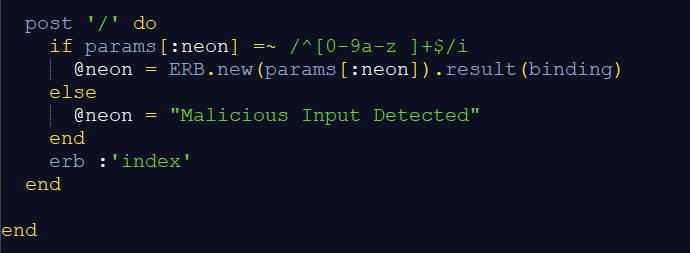
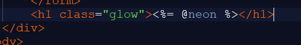
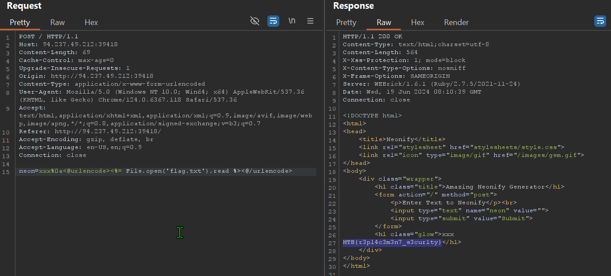

------------------------

### Challenge Description

It's time for a shiny new reveal for the first-ever text neonifier. Come test out our brand new website and make any text glow like a lo-fi neon tube!

### Source Code

This is a simple web application written in Ruby. It will take the user input using the POST method and render it using a template.

But to achieve Template Injection, We need to pass the regex check else it will only render  "Malicious Input Detected" and not our input. \
The regex is `/^[0-9a-z ]+$/i`. It will check if the input is alphanumerical and spaces.

### Bypass The Regex Check

After a bit of research on Regular Expressions in Ruby, `^` Matches the beginning of a line, and `$` Matches the end of a line.
This means the regex won't match anything after the new line.

Reference: https://ruby-doc.com/docs/ProgrammingRuby/html/language.html#UL

Now, We can give our payload after the `%0a`(URL encoded new line character). \
To read the file using Template-Injection, we can use a payload like `<%= File.open('flag.txt').read %>`

Flag: `HTB{r3pl4c3m3n7_s3cur1ty}`

Happy Hacking