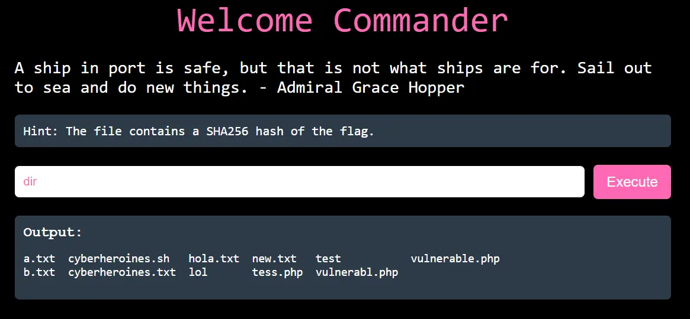
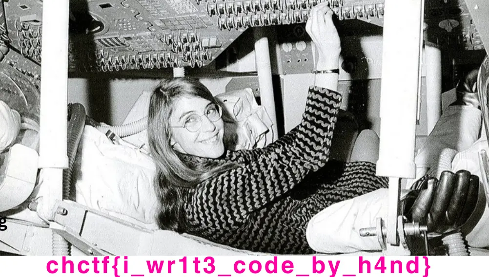

------------------------

> Competition Begins: 5:00 PM EST Sept 8, 2023, \
> Competition Ends: 5:00 PM EST Sept 10, 2023

https://cyberheroines.ctfd.io/


## Crypto

### Sophie Wilson


Description:

```
Sophie Mary Wilson CBE FRS FREng DistFBCS (born Roger Wilson; June 1957) is an English computer scientist, who helped design the BBC Micro and ARM architecture. Wilson first designed a microcomputer during a break from studies at Selwyn College, Cambridge. She subsequently joined Acorn Computers and was instrumental in designing the BBC Micro, including the BBC BASIC programming language whose development she led for the next 15 years. She first began designing the ARM reduced instruction set computer (RISC) in 1983, which entered production two years later. - Wikipedia Entry

Chal: Help this designer of microprocessors solve this RSA challenge.

Author: Prajakta

n = 784605825796844081743664431959835176263022075947576226438671818152943359270141637991489766023643446015742865872000712625430019936454136740701797771130286509865524144933694390307166660453460378136369217557779691427646557961148142476343174636983719280360074558519378409301540506901821748421856695675459425181027041415137193539255615283103443383731129040200129789041119575028910307276622636732661309395711116526188754319667121446052611898829881012810646321599196591757220306998192832374480348722019767057745155849389438587835412231637677550414009243002286940429895577714131959738234773350507989760061442329017775745849359050846635004038440930201719911010249665164009994722320760601629833907039218711773510746120996003955187137814259297909342016383387070174719845935624155702812544944516684331238915119709331429477385582329907357570479058128093340104405708989234237510349688389032334786183065686034574477807623401744101315114981390853183569062407956733111357740976841307293694669943756094245305426874297375074750689836099469106599572126616892447581026611947596122433260841436234316820067372162711310636028751984204768054655406327047223250327323182558843986421816373935439976256688835521454318161553726050385094844798296897844392636332777
e = 5
c = 268593521627440355433888284074970889184087304017829415653214811933857946727694253029979429970950656279149253529187901591829277689165827531120813402199222392031974802458605195286640398523506218117737453271031755512785665400604866722911900724895012035864819085755503886111445816515363877649988898269507252859237015154889693222457900543963979126889264480746852695168237115525211083264827612117674145414459016059712297731655462334276493
```

Here the `e` is small and n is too large, so `m^e < N`

We can get the message by just doing 5th root of `c`.

Python code:
```python
import gmpy2
from Cryptodome.Util.number import long_to_bytes

n = 784605825796844081743664431959835176263022075947576226438671818152943359270141637991489766023643446015742865872000712625430019936454136740701797771130286509865524144933694390307166660453460378136369217557779691427646557961148142476343174636983719280360074558519378409301540506901821748421856695675459425181027041415137193539255615283103443383731129040200129789041119575028910307276622636732661309395711116526188754319667121446052611898829881012810646321599196591757220306998192832374480348722019767057745155849389438587835412231637677550414009243002286940429895577714131959738234773350507989760061442329017775745849359050846635004038440930201719911010249665164009994722320760601629833907039218711773510746120996003955187137814259297909342016383387070174719845935624155702812544944516684331238915119709331429477385582329907357570479058128093340104405708989234237510349688389032334786183065686034574477807623401744101315114981390853183569062407956733111357740976841307293694669943756094245305426874297375074750689836099469106599572126616892447581026611947596122433260841436234316820067372162711310636028751984204768054655406327047223250327323182558843986421816373935439976256688835521454318161553726050385094844798296897844392636332777
e = 5
c = 268593521627440355433888284074970889184087304017829415653214811933857946727694253029979429970950656279149253529187901591829277689165827531120813402199222392031974802458605195286640398523506218117737453271031755512785665400604866722911900724895012035864819085755503886111445816515363877649988898269507252859237015154889693222457900543963979126889264480746852695168237115525211083264827612117674145414459016059712297731655462334276493
gmpy2.get_context().precision = 600
m = gmpy2.root(c, 5)
print(long_to_bytes(int(m)))
```

flag: `chctf{d3516n3d_4c0rn_m1cr0_c0mpu73r}`

<br>

## Web

### Grace Hopper

Description:
```
Grace Brewster Hopper (née Murray; December 9, 1906 – January 1, 1992) was an American computer scientist, mathematician, and United States Navy rear admiral. One of the first programmers of the Harvard Mark I computer, she was a pioneer of computer programming who invented one of the first linkers. Hopper was the first to devise the theory of machine-independent programming languages, and the FLOW-MATIC programming language she created using this theory was later extended to create COBOL, an early high-level programming language still in use today. - Wikipedia Entry

Chal: Command this webapp like this Navy Real Admiral

Alternate (Better) Connection: webapp

Author: Sandesh
```

Link: https://cyberheroines-web-srv2.chals.io/vulnerable.php

On this site we can execute few commands on running `dir` command we can see all files:



The flag is in the `https://cyberheroines-web-srv2.chals.io/cyberheroines.sh` file.

flag: `CHCTF{t#!$_!s_T#3_w@Y}`

<br>

## Forensics

### Barbara Liskov

Description:
```
Barbara Liskov (born November 7, 1939 as Barbara Jane Huberman) is an American computer scientist who has made pioneering contributions to programming languages and distributed computing. Her notable work includes the development of the Liskov substitution principle which describes the fundamental nature of data abstraction, and is used in type theory (see subtyping) and in object-oriented programming (see inheritance). Her work was recognized with the 2008 Turing Award, the highest distinction in computer science. - Wikipedia Entry

Chal: Return the flag back to the 2008 Turing Award Winner

Author: Josh
```

file: BarbaraLiskov.pyc

In this file we can see one Base64 text: `Y2hjdGZ7dV9uM3Yzcl9uMzNkXzBwdDFtNGxfcDNyZjBybTRuYzMsX3VfbjMzZF9nMDBkLTNuMHVnaF9wM3JmMHJtNG5jM30=` this is the flag.

flag: `chctf{u_n3v3r_n33d_0pt1m4l_p3rf0rm4nc3,_u_n33d_g00d-3n0ugh_p3rf0rm4nc3}`

<br>

### Margaret Hamilton

Description:
```
[Margaret Elaine Hamilton](https://en.wikipedia.org/wiki/Margaret_Hamilton_(software_engineer) (née Heafield; born August 17, 1936) is an American computer scientist, systems engineer, and business owner. She was director of the Software Engineering Division of the MIT Instrumentation Laboratory, which developed on-board flight software for NASA's Apollo program. She later founded two software companies—Higher Order Software in 1976 and Hamilton Technologies in 1986, both in Cambridge, Massachusetts. - [Wikipedia Entry](https://en.wikipedia.org/wiki/Margaret_Hamilton_(software_engineer)

Chal: Return the flag to NASAs first software engineer.

Author: Rusheel
```
file: `Apollo-Mystery.png`

This is archive file open this with 7zip and there is a new image `margaret_flag.png` it have flag in it.



flag: `chctf{i_wr1t3_code_by_h4nd}`

Happy Hacking
