__CTF Event URL__: https://ctf.nullcon.net/challenges \
__Event Start Time__: February 1st, 2025, at 08:30 UTC \
__Event End Time__: February 2nd, 2025, at 08:30 UTC

---

## Challenges

### Bfail

**Description:** _To 'B' secure or to 'b' fail? Strong passwords for admins are always great, right?_ \
**URL:** `http://52.59.124.14:5013/`

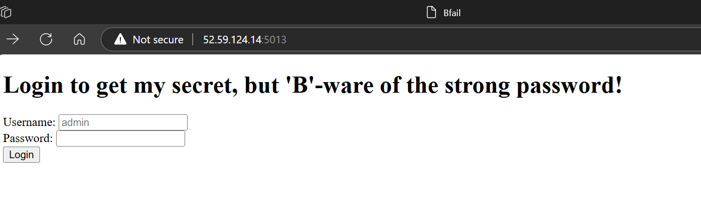

Here we have a simple login page which gives the `Method Not Allowed` error when trying to login. \
In the HTML page source code we have one interesting comment.

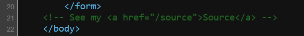

Visiting this path gives us the python source code of the challenge.

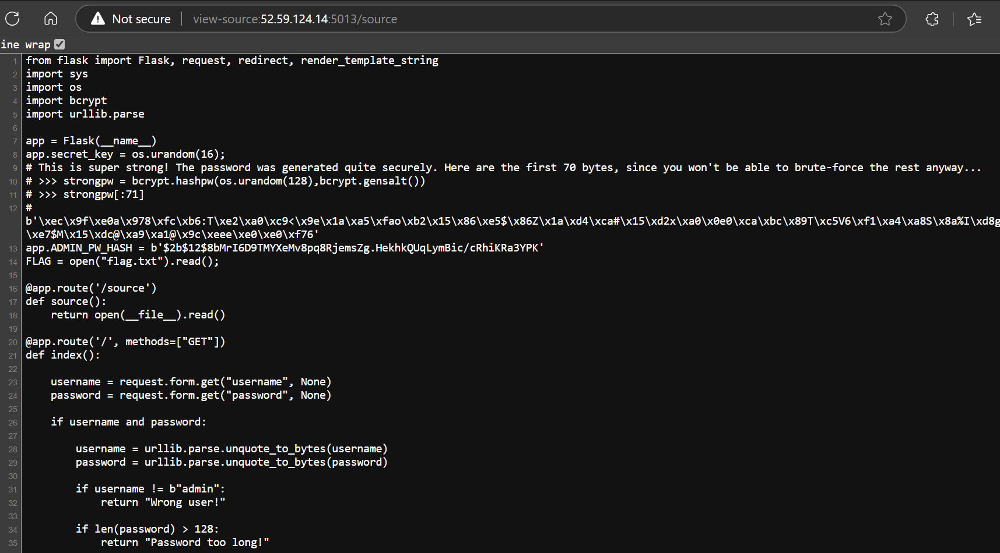

the password is generated using `os.urandom(128)`. It will generate 128 random bytes. impossible to brute force.
and we are also given first 71 bytes of password and password's `bcrypt` hash.

```python
b'\xec\x9f\xe0a\x978\xfc\xb6:T\xe2\xa0\xc9<\x9e\x1a\xa5\xfao\xb2\x15\x86\xe5$\x86Z\x1a\xd4\xca#\x15\xd2x\xa0\x0e0\xca\xbc\x89T\xc5V6\xf1\xa4\xa8S\x8a%I\xd8gI\x15\xe9\xe7$M\x15\xdc@\xa9\xa1@\x9c\xeee\xe0\xe0\xf76'
app.ADMIN_PW_HASH = b'$2b$12$8bMrI6D9TMYXeMv8pq8RjemsZg.HekhkQUqLymBic/cRhiKRa3YPK'
```

To successfully login our password's `bcrypt` hash needs to match above `bcrypt` hash.

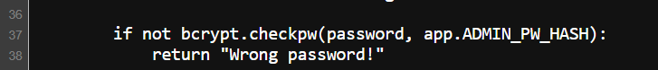

What is `bcrypt` algorithm anyways!

with little bit of research we came to know that `bcrypt` will only take the maximum of first 72 bytes from password when generating the hash.

Refence: [What is Bcrypt and how it works? | NordVPN](https://nordvpn.com/blog/what-is-bcrypt/#:~:text=Bcrypt%20allows%20up%20to%2072%20bytes%20for%20a%20password%2C)

since we are already given the first 71 bytes of password, we only need to brute force one byte (256 total values).

Python code:

```python
import bcrypt

admin_password = b"\xec\x9f\xe0a\x978\xfc\xb6:T\xe2\xa0\xc9<\x9e\x1a\xa5\xfao\xb2\x15\x86\xe5$\x86Z\x1a\xd4\xca#\x15\xd2x\xa0\x0e0\xca\xbc\x89T\xc5V6\xf1\xa4\xa8S\x8a%I\xd8gI\x15\xe9\xe7$M\x15\xdc@\xa9\xa1@\x9c\xeee\xe0\xe0\xf76"
ADMIN_PW_HASH = b"$2b$12$8bMrI6D9TMYXeMv8pq8RjemsZg.HekhkQUqLymBic/cRhiKRa3YPK"
fixed_salt = ADMIN_PW_HASH[:29]  # Cost factor["$2b$12$" - length(7)] + Salt [16 bytes which is then hashed, resulting in a 22-character string] = b'$2b$12$8bMrI6D9TMYXeMv8pq8Rje'

for value in range(256):
    byte_value = bytes([value])
    password = admin_password + byte_value
    hashed_password = bcrypt.hashpw(password, fixed_salt)
    if hashed_password == ADMIN_PW_HASH:
        print("password found:")
        print(password)
        break
```

Output:

```shell
┌──PS(Aftab@Sama)-[~\Downloads\Nullcon HackIM CTF Goa 2025]
└─$ python Bfail.py
password found:
b'\xec\x9f\xe0a\x978\xfc\xb6:T\xe2\xa0\xc9<\x9e\x1a\xa5\xfao\xb2\x15\x86\xe5$\x86Z\x1a\xd4\xca#\x15\xd2x\xa0\x0e0\xca\xbc\x89T\xc5V6\xf1\xa4\xa8S\x8a%I\xd8gI\x15\xe9\xe7$M\x15\xdc@\xa9\xa1@\x9c\xeee\xe0\xe0\xf76\xaa'
```

we got the password but the login request is still giving errors.

looking at the code we can see that it is checking for password and username parameters in request body but it is only accepting the GET requests.

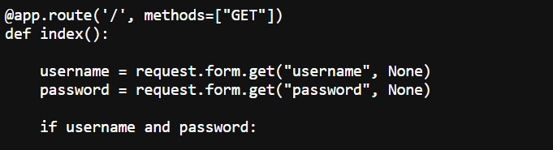

we can pass the username and password in body of GET request (fat GET request).

Python Code:

```python
import urllib
import requests

admin_password = b"\xec\x9f\xe0a\x978\xfc\xb6:T\xe2\xa0\xc9<\x9e\x1a\xa5\xfao\xb2\x15\x86\xe5$\x86Z\x1a\xd4\xca#\x15\xd2x\xa0\x0e0\xca\xbc\x89T\xc5V6\xf1\xa4\xa8S\x8a%I\xd8gI\x15\xe9\xe7$M\x15\xdc@\xa9\xa1@\x9c\xeee\xe0\xe0\xf76\xaa"
encoded_data = urllib.parse.quote_from_bytes(admin_password)
payload = f"username=admin&password={encoded_data}"
print(
    requests.get(
        f"http://52.59.124.14:5013/",
        data=payload,
        headers={"Content-Type": "application/x-www-form-urlencoded"},
    ).content
)
```

Output:

```shell
┌──PS(Aftab@Sama)-[~\Downloads\Nullcon HackIM CTF Goa 2025]
└─$ python Bfail.py
b"Congrats! It appears you have successfully bf'ed the password. Here is your ENO{BCRYPT_FAILS_TO_B_COOL_IF_THE_PW_IS_TOO_LONG}"
```

Flag: `ENO{BCRYPT_FAILS_TO_B_COOL_IF_THE_PW_IS_TOO_LONG}`

---

### Crahp

**Description:** _Oh Crahp, I forgot my credentials! Can you login nontheless?_ \
**URL:** `http://52.59.124.14:5006/`

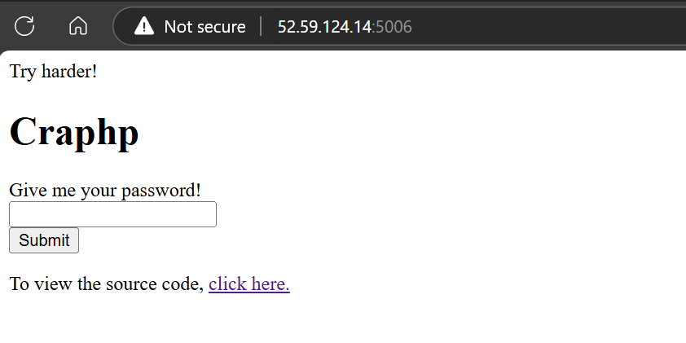

In the source code we can see that we need to satisfy 3 conditions to get the flag:
1. password length should be 15 characters.
2. password should not be equal to "AdM1nP@assW0rd!".
3. `crc16` and `crc8` of our password should match the `crc16` and `crc8` of `AdM1nP@assW0rd!`.

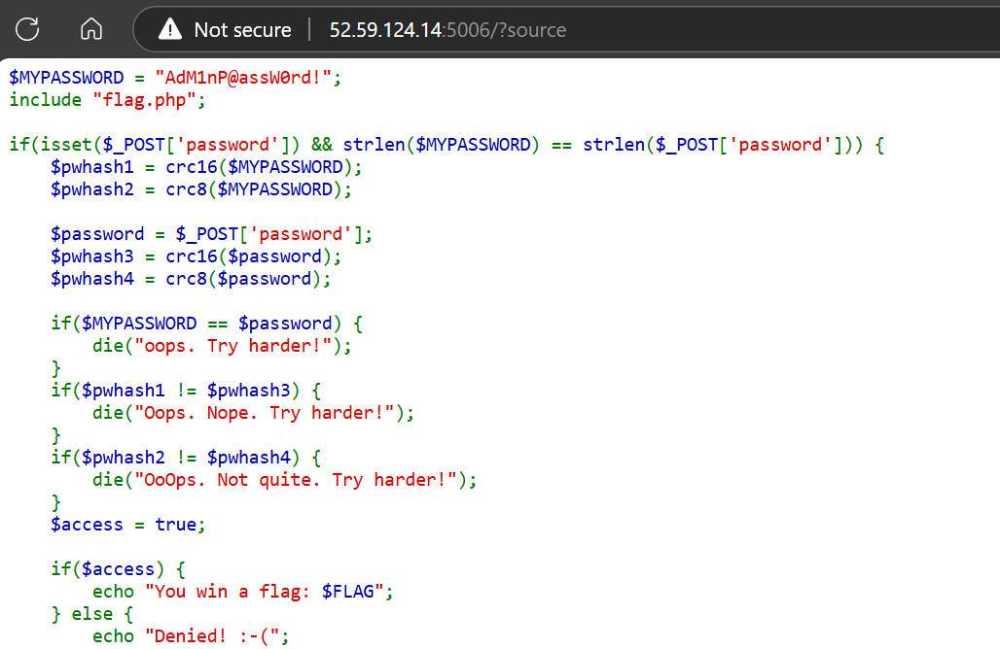

`crc8` and `crc16` are very small length, so multiple inputs have high chances of having the same `crc` hash and can be brute forced easily.

PHP code:

```php
<?php
if(isset($_GET['source'])) {
    highlight_file(__FILE__);
}


// https://www.php.net/manual/en/function.crc32.php#28012
function crc16($string) {
  $crc = 0xFFFF;
  for ($x = 0; $x < strlen ($string); $x++) {
    $crc = $crc ^ ord($string[$x]);
    for ($y = 0; $y < 8; $y++) {
      if (($crc & 0x0001) == 0x0001) {
        $crc = (($crc >> 1) ^ 0xA001);
      } else { $crc = $crc >> 1; }
    }
  }
  return $crc;
}


// https://stackoverflow.com/questions/507041/crc8-check-in-php/73305496#73305496
function crc8($input)
{
$crc8Table = [
    0x00, 0x07, 0x0E, 0x09, 0x1C, 0x1B, 0x12, 0x15,
    0x38, 0x3F, 0x36, 0x31, 0x24, 0x23, 0x2A, 0x2D,
    0x70, 0x77, 0x7E, 0x79, 0x6C, 0x6B, 0x62, 0x65,
    0x48, 0x4F, 0x46, 0x41, 0x54, 0x53, 0x5A, 0x5D,
    0xE0, 0xE7, 0xEE, 0xE9, 0xFC, 0xFB, 0xF2, 0xF5,
    0xD8, 0xDF, 0xD6, 0xD1, 0xC4, 0xC3, 0xCA, 0xCD,
    0x90, 0x97, 0x9E, 0x99, 0x8C, 0x8B, 0x82, 0x85,
    0xA8, 0xAF, 0xA6, 0xA1, 0xB4, 0xB3, 0xBA, 0xBD,
    0xC7, 0xC0, 0xC9, 0xCE, 0xDB, 0xDC, 0xD5, 0xD2,
    0xFF, 0xF8, 0xF1, 0xF6, 0xE3, 0xE4, 0xED, 0xEA,
    0xB7, 0xB0, 0xB9, 0xBE, 0xAB, 0xAC, 0xA5, 0xA2,
    0x8F, 0x88, 0x81, 0x86, 0x93, 0x94, 0x9D, 0x9A,
    0x27, 0x20, 0x29, 0x2E, 0x3B, 0x3C, 0x35, 0x32,
    0x1F, 0x18, 0x11, 0x16, 0x03, 0x04, 0x0D, 0x0A,
    0x57, 0x50, 0x59, 0x5E, 0x4B, 0x4C, 0x45, 0x42,
    0x6F, 0x68, 0x61, 0x66, 0x73, 0x74, 0x7D, 0x7A,
    0x89, 0x8E, 0x87, 0x80, 0x95, 0x92, 0x9B, 0x9C,
    0xB1, 0xB6, 0xBF, 0xB8, 0xAD, 0xAA, 0xA3, 0xA4,
    0xF9, 0xFE, 0xF7, 0xF0, 0xE5, 0xE2, 0xEB, 0xEC,
    0xC1, 0xC6, 0xCF, 0xC8, 0xDD, 0xDA, 0xD3, 0xD4,
    0x69, 0x6E, 0x67, 0x60, 0x75, 0x72, 0x7B, 0x7C,
    0x51, 0x56, 0x5F, 0x58, 0x4D, 0x4A, 0x43, 0x44,
    0x19, 0x1E, 0x17, 0x10, 0x05, 0x02, 0x0B, 0x0C,
    0x21, 0x26, 0x2F, 0x28, 0x3D, 0x3A, 0x33, 0x34,
    0x4E, 0x49, 0x40, 0x47, 0x52, 0x55, 0x5C, 0x5B,
    0x76, 0x71, 0x78, 0x7F, 0x6A, 0x6D, 0x64, 0x63,
    0x3E, 0x39, 0x30, 0x37, 0x22, 0x25, 0x2C, 0x2B,
    0x06, 0x01, 0x08, 0x0F, 0x1A, 0x1D, 0x14, 0x13,
    0xAE, 0xA9, 0xA0, 0xA7, 0xB2, 0xB5, 0xBC, 0xBB,
    0x96, 0x91, 0x98, 0x9F, 0x8A, 0x8D, 0x84, 0x83,
    0xDE, 0xD9, 0xD0, 0xD7, 0xC2, 0xC5, 0xCC, 0xCB,
    0xE6, 0xE1, 0xE8, 0xEF, 0xFA, 0xFD, 0xF4, 0xF3
];

    $byteArray = unpack('C*', $input);
    $len = count($byteArray);
    $crc = 0;
    for ($i = 1; $i <= $len; $i++) {
        $crc = $crc8Table[($crc ^ $byteArray[$i]) & 0xff];
    }
    return $crc & 0xff;
}

$MYPASSWORD = "AdM1nP@assW0rd!";

$pwhash1 = crc16($MYPASSWORD);
$pwhash2 = crc8($MYPASSWORD);
echo "crc16 = $pwhash1 \n";
echo "crc8 = $pwhash2 \n";
$number = 100000000000000;
while (true) {
    $combination = strval($number);
    if (crc16($combination) === $pwhash1 && crc8($combination) === $pwhash2) {
        echo "Match found: $combination\n";
        $found = true;
        break;
        exit;
    }
    $number++;
}

?>
```

Output:

```shell
┌──PS(Aftab@Sama)-[~\Downloads\Nullcon HackIM CTF Goa 2025]
└─$ php craph.php  
crc16 = 25010 
crc8 = 167 
Match found: 100000010130312
```

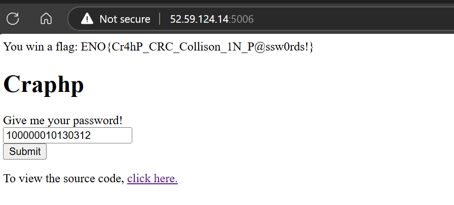

Flag: `ENO{Cr4hP_CRC_Collison_1N_P@ssw0rds!}`

---

### Numberizer

**Description:** _Are you good with numbers?_ \
**URL:** `http://52.59.124.14:5004/`

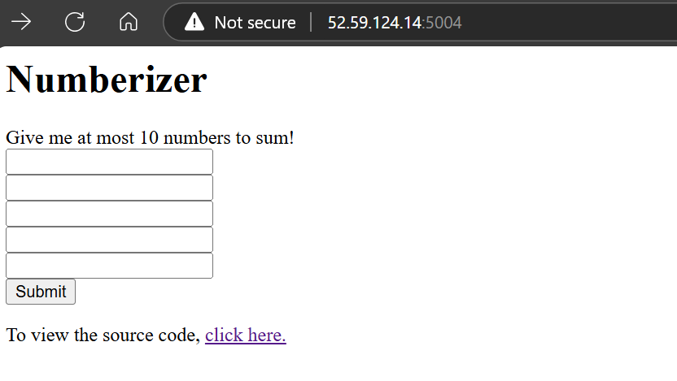

To get the flag we need to satisfy the following conditions:
- Input should be a number.
- we send 5 numbers.
- The number should not be negative.
- length of each input should not be greater than 4.
- to get the flag total sum of all numbers should be less than 0.

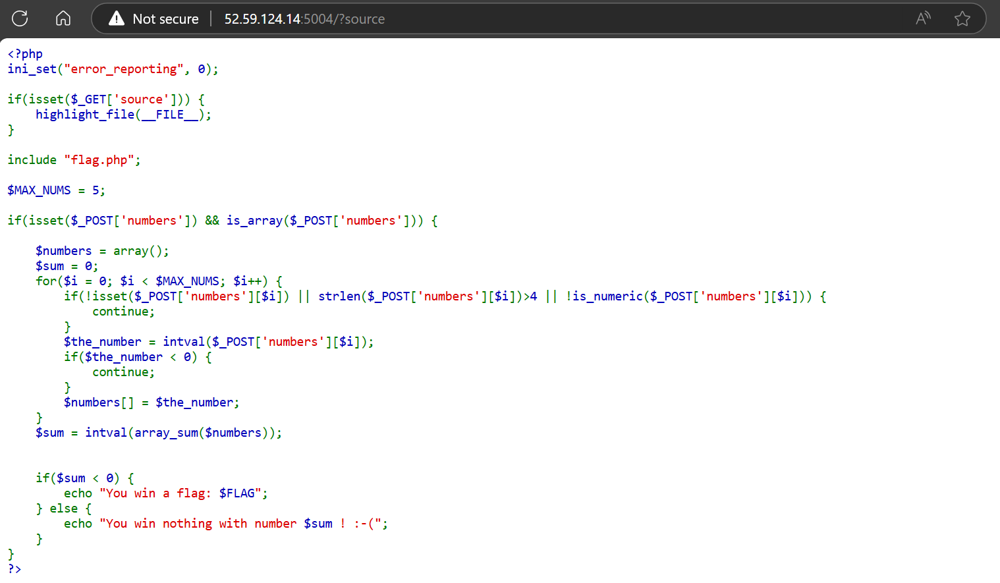

are you thinking of integer overflow ?

For integer overflow to occur, the number has to be large enough so that it will wrap around to its minimum negative value. but we limited to input with max length of 4.

ever heard of `E notation` or `exponential notation` !

It's those numbers like `3e2` which is equivalent of <code>3×10<sup>2</sup></code>.

Reference: [Scientific notation - Wikipedia](https://en.wikipedia.org/wiki/Scientific_notation#E_notation)

now we can have very large number within 4 characters limit. \
`9e99` will become <code>9x10<sup>99</sup></code>.

submit this as input and it will overflow the integer.

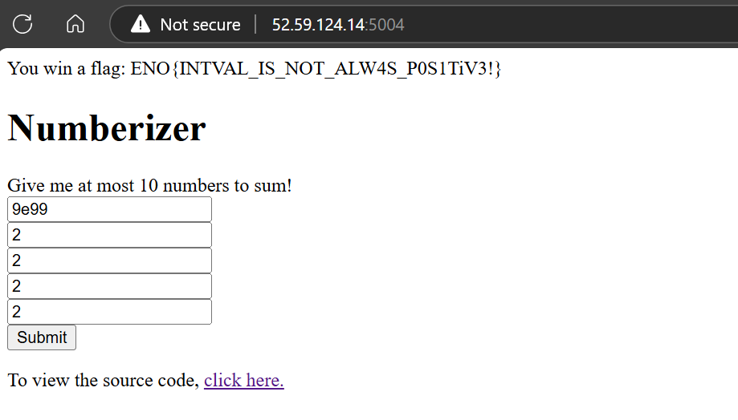

Flag: `ENO{INTVAL_IS_NOT_ALW4S_P0S1TiV3!}`

-----

### Paginator

**Description:** _There can't much go wrong with pagination, right?_ \
**URL:** `http://52.59.124.14:5012/`

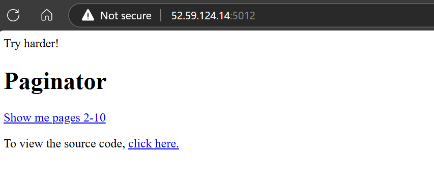

The flag is stored at first index. `$min` and `$max` values are taken from GET parameter `p`. and the value of `$min` should not be <=1.

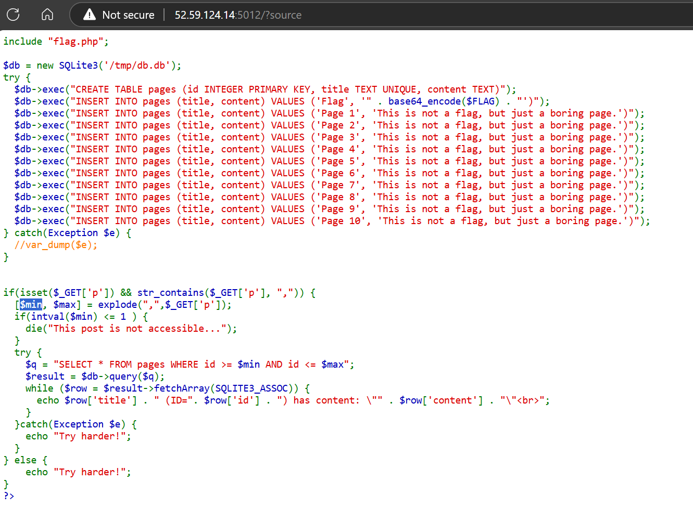

After that the `$min` and `$max` are used in SQL query directly.

are you thinking of SQL injection?

correct, and we don't even need to escape any quotes because there are no quotes.

payload like `OR 1=1` should work. let's try it!

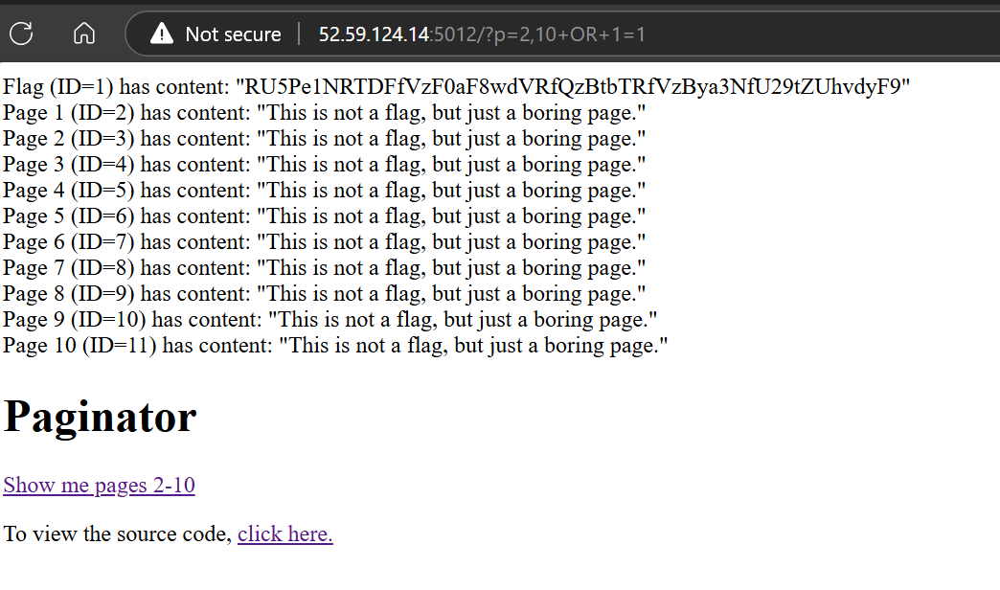

```shell
$ echo "RU5Pe1NRTDFfVzF0aF8wdVRfQzBtbTRfVzBya3NfU29tZUhvdyF9" | base64 -d
ENO{SQL1_W1th_0uT_C0mm4_W0rks_SomeHow!}
```

Flag: `ENO{SQL1_W1th_0uT_C0mm4_W0rks_SomeHow!}`

-----

### Sess.io

**Description:** _Long sessions must be secure, right?_ \
**URL:** `http://52.59.124.14:5008/`

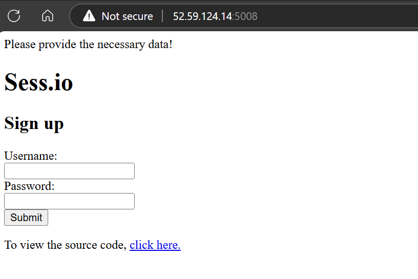

Source code:

```php
<?php
define("ALPHA", str_split("abcdefghijklmnopqrstuvwxyz0123456789_-"));
ini_set("error_reporting", 0);

if(isset($_GET['source'])) {
    highlight_file(__FILE__);
}

include "flag.php"; // $FLAG
$SEEDS = str_split($FLAG, 4);

function session_id_secure($id) {
    global $SEEDS;
    mt_srand(intval(bin2hex($SEEDS[md5($id)[0] % (count($SEEDS))]),16));
    $id = "";
    for($i=0;$i<1000;$i++) {
        $id .= ALPHA[mt_rand(0,count(ALPHA)-1)];
    }
    return $id;
}

if(isset($_POST['username']) && isset($_POST['password'])) {
    session_id(session_id_secure($_POST['username'] . $_POST['password']));
    session_start();
    echo "Thank you for signing up!";
}else {
    echo "Please provide the necessary data!";
}
?>
```

Here `username` + `password` is passed to the `session_id($id)` function.

```php
session_id(session_id_secure($_POST['username'] . $_POST['password']));
```

`$SEEDS` is array of flag with each element of length 4.

```php
$SEEDS = str_split($FLAG, 4);
```

first character from `md5($id)` is used as index in the `$SEEDS` array. the `$id` is concatenation of the `username` and `password` we submit.

```php
mt_srand(intval(bin2hex($SEEDS[md5($id)[0] % (count($SEEDS))]),16));
```

The specific item at index of `md5($id)[0]` in `$SEEDS` array which is also part of the flag is then converted from string to hex using `bin2hex` and then from hex to integer using `intval`.

This integer is used as seed for PHP's mt_rand random number generator. and using that seed it will generate 1000 numbers to create a session id.

```php
for($i=0;$i<1000;$i++) {
        $id .= ALPHA[mt_rand(0,count(ALPHA)-1)];
    }
```

The generated number is used as index to get the specific character from `ALPHA` string array.

```php
define("ALPHA", str_split("abcdefghijklmnopqrstuvwxyz0123456789_-"));
```
To get the flag from this session id we need to get the value of seed.

With simple search we can find [openwall/php_mt_seed: PHP mt_rand() seed cracker](https://github.com/openwall/php_mt_seed) tool to brute force and crack the seed used.

In this repo we have the following `pw2args.php` file to convert the password string to arguments that this tool can use. In this we need to update the `$allowable_characters` string with `$ALPHA` string from challenge code.

```php
<?php
$allowable_characters = 'abcdefghijklmnopqrstuvwxyz0123456789_-';
$len = strlen($allowable_characters) - 1;
$pass = $argv[1];
for ($i = 0; $i < strlen($pass); $i++) {
    $number = strpos($allowable_characters, $pass[$i]);
    echo "$number $number 0 $len  ";
}
echo "\n";
?>
```

Now we just need to get the flag in correct order using specific inputs that have their first characters from 0-9.
with simple python script we can get following values which have first character of md5 as 0-9.

```python
0 : 63
1 : 69
2 : 88
3 : 85
4 : 81
5 : 91
6 : 84
7 : 89
8 : 90
9 : 86
```

submit these values as password to get the blocks of flag and use first 10-15 characters to crack the seed.

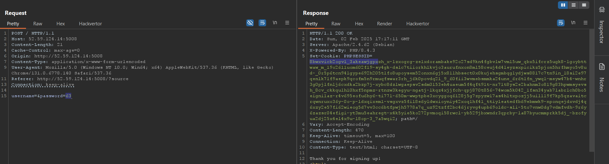

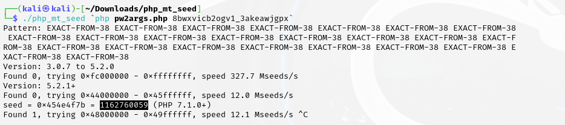

Once we get the seed we will convert it from integer > hex > string.

```python
int_value = 1162760059
hex_value = hex(int_value)[2:]
if len(hex_value) % 2 != 0:
    hex_value = "0" + hex_value
binary_data = bytes.fromhex(hex_value)
original_value = binary_data.decode()
print("Original Value:", original_value)
```

Output:

```shell
┌──PS(Aftab@Sama)-[~\Downloads\Nullcon HackIM CTF Goa 2025]
└─$ python sess_io.py
Original Value: ENO{
```

This output looks promising, first 4 character of flag.

repeat this process for rest of the blocks and eventually we get the flag.

Flag: `ENO{SOME_SUPER_SECURE_FLAG_1333337_HACK}`


Happy Hacking
